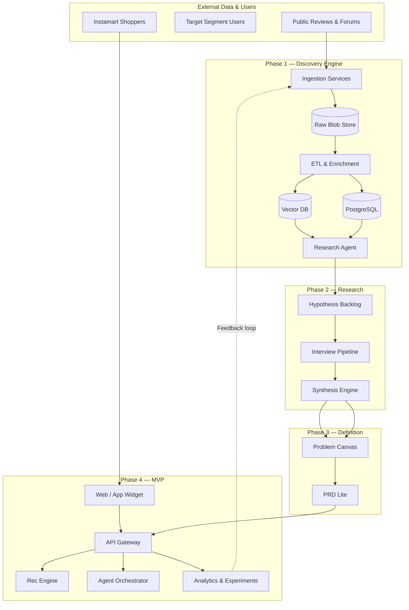
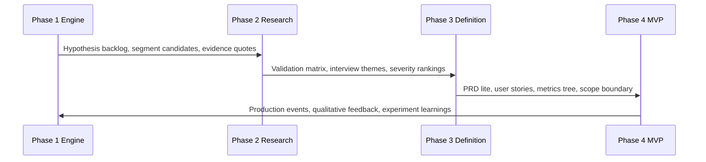

# Architecture Overview — Swiggy Instamart New Category Discovery

## Purpose

This architecture suite defines how to increase the percentage of **Monthly Active Customers (MAC)** who purchase from at least one **new category** every month on Swiggy Instamart. The work is organized into four sequential phases, each with its own systems, data models, workflows, and deliverables.

## Document Index

| Document | Description |
|----------|-------------|
| [Phase 1 — AI Discovery Engine](./phase1-ai-discovery-engine.md) | Data ingestion, NLP pipeline, RAG, agent workflows, insight validation |
| [Phase 2 — User Research Validation](./phase2-user-research-validation.md) | Interview ops, synthesis pipeline, validation matrix |
| [Phase 3 — Problem Definition](./phase3-problem-definition.md) | Problem canvas, PRD lite, metrics tree, MVP scoping |
| [Phase 4 — AI-Native MVP](./phase4-ai-native-mvp.md) | Production system design, APIs, deployment, experimentation |
| [Appendix — Schemas & Contracts](./appendix-schemas-and-contracts.md) | Shared data models, event schemas, API specs |

## North-Star & Metrics Hierarchy

```
North-Star Metric
└── % MAC with ≥1 new category purchase in rolling 30 days
    ├── Input metrics
    │   ├── Nudge impression rate (eligible users who see widget)
    │   ├── Nudge CTR (click / impression)
    │   ├── Starter bundle add-to-cart rate
    │   └── New category checkout conversion
    ├── Quality metrics
    │   ├── Time to first new category (days from first order)
    │   ├── Repeat new-category rate (2nd new category within 60 days)
    │   └── Category exploration depth (distinct categories / user / quarter)
    └── Guardrail metrics
        ├── Core reorder rate (must not drop >2% vs control)
        ├── Order completion rate
        ├── Widget dismiss rate
        └── Support tickets related to recommendations
```

## End-to-End Architecture



## Phase Summary

| Phase | Duration (Indicative) | Core System | Primary Output |
|-------|----------------------|-------------|----------------|
| **1** | 2–3 weeks | AI Discovery Engine | Insight corpus + research brief |
| **2** | 2 weeks | Interview & synthesis pipeline | Validation matrix + ranked pain points |
| **3** | 1 week | Problem framing workshop | Problem statement + PRD lite |
| **4** | 3–5 weeks | Smart Category Bridge MVP | Deployed product + experiment results |

## Cross-Phase Handoffs



## Recommended Repository Structure

```
SwiggyInstamart_Order_NewCategory/
├── doc/
│   ├── problemStatement.md
│   ├── phaseWiseArchitecture.md          # Summary (links here)
│   └── architecture/                     # Detailed phase docs (this folder)
├── phase1-discovery/
│   ├── ingestion/                        # Crawlers, schedulers
│   ├── processing/                       # ETL, NER, embeddings
│   ├── analysis/                         # Clustering, RAG, agents
│   └── outputs/                          # Briefs, dashboards
├── phase2-research/
│   ├── screener/
│   ├── guides/
│   ├── transcripts/
│   └── synthesis/
├── phase3-definition/
│   ├── problem-statement.md
│   └── prd-lite.md
└── phase4-mvp/
    ├── frontend/
    ├── backend/
    ├── ai/
    └── infra/
```

## Technology Principles

1. **AI-native by default** — LLMs and agents for analysis, synthesis, and personalization; not bolt-on.
2. **Evidence-linked insights** — Every claim in Phases 1–3 must trace to source quotes or interview excerpts.
3. **Validate before build** — MVP scope is constrained by Phase 2 confirmation, not Phase 1 speculation alone.
4. **Production-grade MVP** — Phase 4 includes auth, monitoring, experimentation, and rollback—not a static prototype.
5. **Closed-loop learning** — Phase 4 behavioral data feeds back into Phase 1 corpus for continuous improvement.

## Security & Compliance (All Phases)

| Concern | Phase 1 | Phase 2 | Phase 3 | Phase 4 |
|---------|---------|---------|---------|---------|
| PII handling | Redact from public scrapes | Consent + anonymization | No raw PII in docs | Feature-only prompts |
| Data retention | 90-day raw, indefinite aggregated | Delete recordings per policy | N/A | Event TTL per policy |
| Platform ToS | Respect robots.txt, API limits | N/A | N/A | Swiggy data policies |
| Model safety | Hallucination checks | N/A | N/A | Guardrails on outputs |

## Risk Register (Cross-Phase)

| ID | Risk | Impact | Mitigation | Owner Phase |
|----|------|--------|------------|-------------|
| R1 | AI themes are generic | Wrong MVP direction | Quote-linking, human review, Phase 2 | 1, 2 |
| R2 | Segment mis-selection | Low experiment lift | Scoring model from Phase 1 + screener | 2 |
| R3 | MVP disrupts habit loop | Reorder rate drop | Guardrail metrics, easy dismiss | 4 |
| R4 | LLM latency in prod | Poor UX | Pre-compute + cache | 4 |
| R5 | Insufficient interview depth | Weak problem frame | 45–60 min guide, probe barriers | 2 |

---

*For implementation-level detail, proceed to the phase-specific documents linked in the index above.*
