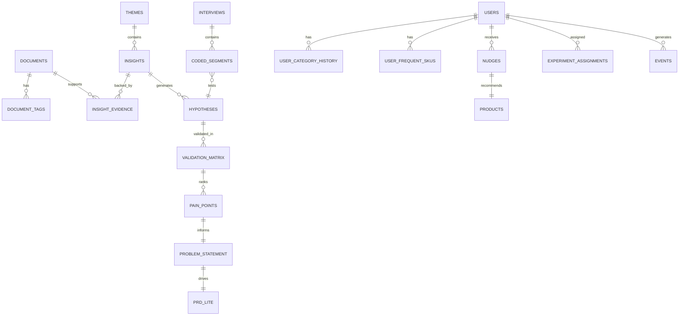

# Appendix — Schemas, Contracts & Shared Definitions

This appendix consolidates cross-phase data models, API contracts, event schemas, and shared taxonomies referenced across all phase architecture documents.

---

## 1. Shared Taxonomies

### 1.1 Category Taxonomy

| Code | Label | Parent |
|------|-------|--------|
| `groceries` | Groceries | — |
| `snacks_beverages` | Snacks & Beverages | — |
| `household_essentials` | Household Essentials | — |
| `personal_care` | Personal Care | — |
| `pet_supplies` | Pet Supplies | — |
| `baby_products` | Baby Products | — |
| `pharmacy` | Pharmacy & Wellness | — |
| `electronics` | Electronics | — |

### 1.2 User Segment Taxonomy

| Code | Label | Definition |
|------|-------|------------|
| `habitual_grocery_repeater` | Habitual Grocery Repeater | 2+ orders/month, ≥80% grocery/snack spend, 0 adjacent category purchases |
| `single_category_snack` | Single-Category Snack Buyer | ≥90% snack/beverage spend only |
| `household_expander` | Household Expander | Regular household essentials, no personal care |
| `explorer` | Category Explorer | ≥3 categories in 90 days (comparison segment) |

### 1.3 Barrier Taxonomy

| Code | Label | Phase 1 Tag | Phase 2 Code |
|------|-------|-------------|--------------|
| `B1_habit` | Habit / Reorder lock-in | `barrier:habit` | `HABIT_REORDER` |
| `B2_trust` | Trust / Quality uncertainty | `barrier:trust` | `BARRIER_TRUST` |
| `B3_discovery` | Discovery friction | `barrier:discovery` | `FRICTION_DISCOVERY` |
| `B4_price` | Price sensitivity | `barrier:price` | — |
| `B5_cognitive` | Cognitive overload | `barrier:cognitive` | — |
| `B6_delivery` | Delivery / Freshness concern | `barrier:delivery` | — |
| `B7_social` | Need for social proof | `barrier:social` | `NEED_SOCIAL_PROOF` |

### 1.4 Research Question IDs

| ID | Question |
|----|----------|
| Q1 | Why do users repeatedly buy from the same categories? |
| Q2 | What prevents users from exploring new categories? |
| Q3 | How do users discover products today? |
| Q4 | What role do habits play in shopping behavior? |
| Q5 | What information do users need before trying a new category? |
| Q6 | What frustrations emerge repeatedly? |
| Q7 | Which user segments are more likely to experiment? |
| Q8 | What unmet needs emerge consistently? |

---

## 2. Cross-Phase Entity Relationship Diagram



---

## 3. Phase Handoff Schemas

### 3.1 Phase 1 → Phase 2: `hypothesis-backlog.json`

```json
{
  "$schema": "handoff/hypothesis-backlog/v1",
  "generated_at": "2026-02-01T00:00:00Z",
  "corpus_stats": {
    "document_count": 847,
    "source_types": ["app_store", "play_store", "reddit", "forum"],
    "date_range": {"start": "2025-10-01", "end": "2026-01-31"}
  },
  "hypotheses": [
    {
      "id": "HYP-001",
      "statement": "Weekly grocery reorders create a habit loop that prevents browsing non-grocery categories",
      "research_question": "Q1",
      "theme_id": "theme-uuid-here",
      "barrier_codes": ["B1_habit"],
      "segment_signals": ["habitual_grocery_repeater"],
      "confidence": "high",
      "evidence_document_ids": ["doc-uuid-1", "doc-uuid-2", "doc-uuid-3"],
      "sample_quotes": [
        "I just reorder the same stuff every week",
        "Too lazy to browse, reorder button is too easy"
      ],
      "suggested_interview_probe": "Walk me through your last 3 Instamart orders. Did you browse anything outside groceries?",
      "suggested_screener_field": "order_frequency >= 2/month AND adjacent_category_purchases == 0"
    }
  ],
  "segment_candidates": [
    {
      "code": "habitual_grocery_repeater",
      "score": 8.7,
      "rationale": "Highest evidence volume + business impact + MVP testability"
    }
  ]
}
```

### 3.2 Phase 2 → Phase 3: `validation-matrix.json`

```json
{
  "$schema": "handoff/validation-matrix/v1",
  "generated_at": "2026-02-20T00:00:00Z",
  "segment": {
    "code": "habitual_grocery_repeater",
    "interviews_completed": 6
  },
  "matrix": [
    {
      "hypothesis_id": "HYP-001",
      "phase1_statement": "Reorder habit prevents category exploration",
      "status": "confirmed",
      "evidence_count": 5,
      "interview_ids": ["INT-001", "INT-002", "INT-003", "INT-004", "INT-006"],
      "supporting_quotes": [
        {"interview_id": "INT-001", "line_ref": "L42", "quote": "I just hit reorder every Sunday"},
        {"interview_id": "INT-003", "line_ref": "L18", "quote": "Same cart, same time, every week"}
      ],
      "notes": "Strong consensus across 5/6 participants"
    }
  ],
  "new_findings": [
    {
      "id": "NEW-001",
      "statement": "Users prefer starter bundles over single full-size products",
      "evidence_count": 3,
      "interview_ids": ["INT-002", "INT-004", "INT-005"],
      "implication": "MVP should offer 2-3 item bundles, not single SKU recommendations"
    }
  ],
  "pain_point_rankings": [
    {
      "rank": 1,
      "title": "Reorder autopilot blocks discovery",
      "frequency": "5/6",
      "avg_severity": 4.2,
      "hypothesis_ids": ["HYP-001"],
      "top_quote": "I just hit reorder every Sunday"
    }
  ]
}
```

### 3.3 Phase 3 → Phase 4: `user-stories.json`

```json
{
  "$schema": "handoff/user-stories/v1",
  "generated_at": "2026-02-25T00:00:00Z",
  "problem_statement_ref": "phase3-definition/problem-statement.md",
  "experiment_hypothesis": "Showing habitual grocery buyers a single AI-personalized category nudge with starter bundle will increase new-category purchase rate by ≥15% without degrading reorder rate by >2%",
  "stories": [
    {
      "id": "US-001",
      "title": "Contextual category nudge",
      "persona": "habitual_grocery_repeater",
      "priority": "P0",
      "story": "As a habitual grocery buyer, I want to see one relevant new category suggestion after adding my usual items, so that I can discover something useful without extra browsing.",
      "acceptance_criteria": [
        "Nudge appears when cart matches habitual pattern (≥3 recurring SKUs or ≥70% overlap)",
        "Shows exactly one category per session",
        "Includes AI-generated rationale (≤2 sentences, ≤280 chars)",
        "Dismissible in one tap",
        "Does not reappear after dismiss in same session"
      ],
      "dependencies": ["FR-01", "FR-02", "FR-03"],
      "wireframe_ref": "wireframes/nudge-shown.png"
    },
    {
      "id": "US-002",
      "title": "Starter bundle",
      "persona": "habitual_grocery_repeater",
      "priority": "P0",
      "story": "As a hesitant buyer, I want a small curated bundle in the suggested category, so that I can try without committing to full-size products.",
      "acceptance_criteria": [
        "Bundle contains 2-3 SKUs from recommended category",
        "All SKUs rated ≥4.0 or marked popular",
        "Total bundle price displayed prominently",
        "One-tap add all to cart"
      ],
      "dependencies": ["FR-04"]
    },
    {
      "id": "US-003",
      "title": "Nudge feedback",
      "persona": "habitual_grocery_repeater",
      "priority": "P0",
      "story": "As a user, I want to give quick feedback on the suggestion, so that future suggestions improve.",
      "acceptance_criteria": [
        "Thumbs up / thumbs down buttons",
        "Optional reason selection on downvote",
        "Feedback stored as analytics event"
      ],
      "dependencies": ["FR-06"]
    }
  ],
  "functional_requirements": [
    {"id": "FR-01", "description": "Habitual cart detection service", "priority": "P0"},
    {"id": "FR-02", "description": "Category recommendation engine with adjacency graph", "priority": "P0"},
    {"id": "FR-03", "description": "AI rationale generation with guardrails", "priority": "P0"},
    {"id": "FR-04", "description": "Starter bundle assembly service", "priority": "P0"},
    {"id": "FR-05", "description": "A/B experiment assignment (50/50)", "priority": "P0"},
    {"id": "FR-06", "description": "Analytics event ingestion pipeline", "priority": "P0"},
    {"id": "FR-07", "description": "Recommendation pre-computation cache", "priority": "P1"}
  ],
  "non_goals": [
    "Native Instamart app integration",
    "Push notifications",
    "Chat assistant",
    "Multi-language support",
    "Multi-category nudges per session"
  ]
}
```

---

## 4. Analytics Event Schema

### 4.1 Event Envelope

All events share this structure:

```json
{
  "event_name": "string — snake_case",
  "event_id": "uuid — unique per event",
  "user_id": "string",
  "session_id": "string",
  "timestamp": "ISO 8601 UTC",
  "properties": {},
  "context": {
    "app_version": "string",
    "platform": "web | ios | android",
    "experiment_arm": "control | treatment | null"
  }
}
```

### 4.2 Event Catalog

#### `nudge_eligible`

Fired when cart evaluated and user matches habitual pattern.

```json
{
  "event_name": "nudge_eligible",
  "properties": {
    "cart_signature": "string",
    "overlap_count": "integer",
    "overlap_ratio": "float",
    "primary_category": "string",
    "segment": "string"
  }
}
```

#### `nudge_shown`

```json
{
  "event_name": "nudge_shown",
  "properties": {
    "nudge_id": "string",
    "category": "string",
    "rec_score": "float",
    "bundle_id": "string",
    "bundle_price": "number",
    "rationale_length": "integer",
    "is_ai_rationale": "boolean"
  }
}
```

#### `nudge_clicked`

```json
{
  "event_name": "nudge_clicked",
  "properties": {
    "nudge_id": "string",
    "category": "string",
    "click_target": "bundle | category_name | rationale"
  }
}
```

#### `nudge_dismissed`

```json
{
  "event_name": "nudge_dismissed",
  "properties": {
    "nudge_id": "string",
    "category": "string",
    "dismiss_reason": "not_relevant | already_buy_elsewhere | not_now | null",
    "time_on_screen_ms": "integer"
  }
}
```

#### `bundle_added`

```json
{
  "event_name": "bundle_added",
  "properties": {
    "nudge_id": "string",
    "bundle_id": "string",
    "category": "string",
    "sku_ids": ["string"],
    "total_price": "number"
  }
}
```

#### `nudge_feedback`

```json
{
  "event_name": "nudge_feedback",
  "properties": {
    "nudge_id": "string",
    "rating": "up | down",
    "reason": "string | null"
  }
}
```

#### `new_category_purchased`

North-star supporting event.

```json
{
  "event_name": "new_category_purchased",
  "properties": {
    "order_id": "string",
    "category": "string",
    "is_first_time": "boolean",
    "sku_ids": ["string"],
    "order_value": "number",
    "nudge_attributed": "boolean",
    "nudge_id": "string | null"
  }
}
```

#### `control_exposed`

Fired for control arm users who were eligible but saw no nudge.

```json
{
  "event_name": "control_exposed",
  "properties": {
    "cart_signature": "string",
    "experiment_id": "string"
  }
}
```

---

## 5. OpenAPI Summary (Phase 4)

Full spec at `phase4-mvp/backend/openapi.yaml`. Summary:

| Method | Path | Description | Auth |
|--------|------|-------------|------|
| POST | `/cart/evaluate` | Evaluate cart, return nudge if eligible | JWT |
| POST | `/cart/add-bundle` | Add bundle SKUs to cart | JWT |
| POST | `/nudge/dismiss` | Record dismissal | JWT |
| POST | `/nudge/feedback` | Record thumbs up/down | JWT |
| POST | `/orders` | Complete order, detect new category | JWT |
| POST | `/events` | Batch analytics events | JWT |
| GET | `/users/{id}/profile` | Get user profile + history | JWT |
| GET | `/experiments/{id}/results` | Experiment funnel (admin) | Admin JWT |
| GET | `/health` | Health check | None |

---

## 6. Metrics Definitions

| Metric | Definition | Formula | Source |
|--------|------------|---------|--------|
| **North-star** | MAC new-category rate | Users with ≥1 first-time category purchase in 30d / MAC | `new_category_purchased` events |
| **Nudge impression rate** | Eligible users who see nudge | `nudge_shown` / `nudge_eligible` | Events |
| **Nudge CTR** | Click on nudge | `nudge_clicked` / `nudge_shown` | Events |
| **Bundle add rate** | Add bundle after seeing nudge | `bundle_added` / `nudge_shown` | Events |
| **New category conversion** | Purchase new category after nudge | `new_category_purchased WHERE nudge_attributed` / `nudge_shown` | Events |
| **Dismiss rate** | Dismiss without action | `nudge_dismissed` / `nudge_shown` | Events |
| **Reorder rate (guardrail)** | Users who complete habitual reorder | Orders with habitual signature / eligible users | Orders |
| **Time to first new category** | Days from first order to first new category | `first_new_category_date - first_order_date` | User history |

---

## 7. LLM Prompt Registry (Versioned)

### 7.1 `rationale_v1`

```
System: You are a helpful Instamart shopping assistant. Write concise, friendly copy.
Never mention user PII. Max 2 sentences. Max 280 characters.

User context (anonymized):
- Primary category: {{primary_category}}
- Order frequency: {{order_frequency_band}}
- Suggested category: {{suggested_category}}

Product signals:
{{rag_context}}

Write a personalized rationale for trying {{suggested_category}}.
Reference shopping pattern, not personal details. No superlatives.
```

### 7.2 `theme_label_v1` (Phase 1)

```
Given these representative quotes from a cluster of user reviews/discussions:
{{quotes}}

Provide:
1. theme_label: Name this theme in ≤8 words
2. description: 2-sentence description
3. research_questions: Which of Q1-Q8 does this theme address (array)
4. barrier_codes: Applicable barrier codes from taxonomy (array)
```

### 7.3 `interview_coding_v1` (Phase 2)

```
Analyze this interview excerpt and return JSON:
{
  "codes": ["CODE1", "CODE2"],
  "hypothesis_ids": ["HYP-001"],
  "quote": "exact verbatim span from excerpt",
  "sentiment": "negative|neutral|positive",
  "severity": 1-5
}

Available codes: HABIT_REORDER, BARRIER_TRUST, WORKAROUND_AMAZON,
NEED_SOCIAL_PROOF, NEED_LOW_RISK, FRICTION_DISCOVERY, POSITIVE_NUDGE, NEGATIVE_NUDGE

Excerpt:
{{excerpt}}
```

---

## 8. Error Code Catalog (Phase 4 API)

| Code | HTTP | Message | Client Action |
|------|------|---------|---------------|
| `CART_EMPTY` | 400 | Cart has no items | Add items first |
| `USER_NOT_FOUND` | 404 | User profile not found | Re-authenticate |
| `NUDGE_NOT_FOUND` | 404 | Nudge ID invalid | Refresh cart |
| `NOT_ELIGIBLE` | 200 | User not eligible (not error) | No widget shown |
| `LLM_UNAVAILABLE` | 503 | AI service down | Show template rationale |
| `RATE_LIMITED` | 429 | Too many requests | Retry with backoff |
| `GUARDRAIL_BLOCKED` | 200 | Rationale failed guardrails | Template used (logged) |

---

## 9. Category Adjacency Matrix

Used by Recommendation Service (Phase 4) and segment analysis (Phase 1).

| Primary Category → Suggested | Weight |
|------------------------------|--------|
| groceries → personal_care | 0.9 |
| groceries → pet_supplies | 0.7 |
| groceries → baby_products | 0.6 |
| groceries → household_essentials | 0.8 |
| snacks_beverages → personal_care | 0.6 |
| snacks_beverages → household_essentials | 0.7 |
| household_essentials → personal_care | 0.8 |
| household_essentials → baby_products | 0.7 |

---

## 10. Glossary

| Term | Definition |
|------|------------|
| **MAC** | Monthly Active Customer — placed ≥1 order in rolling 30 days |
| **New category** | Category never purchased by user before on Instamart |
| **Habitual cart** | Cart where ≥3 SKUs or ≥70% overlap with user's frequent SKU set |
| **Adjacent category** | Category logically related to user's primary category but not yet purchased |
| **Starter bundle** | Curated 2–3 SKU set for low-risk trial of a new category |
| **Category Bridge** | MVP widget surfacing one adjacent category nudge in-cart |
| **Nudge** | In-app suggestion to explore a new category |
| **Validation matrix** | Phase 2 artifact mapping AI hypotheses to confirmed/challenged/new status |
| **North-star metric** | % MAC purchasing from ≥1 new category per month |
