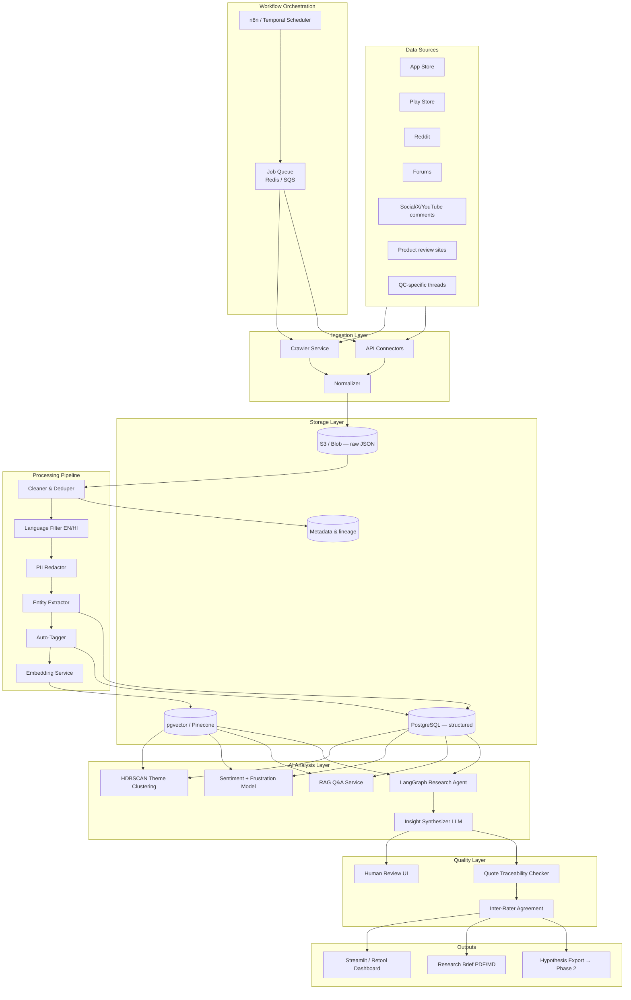
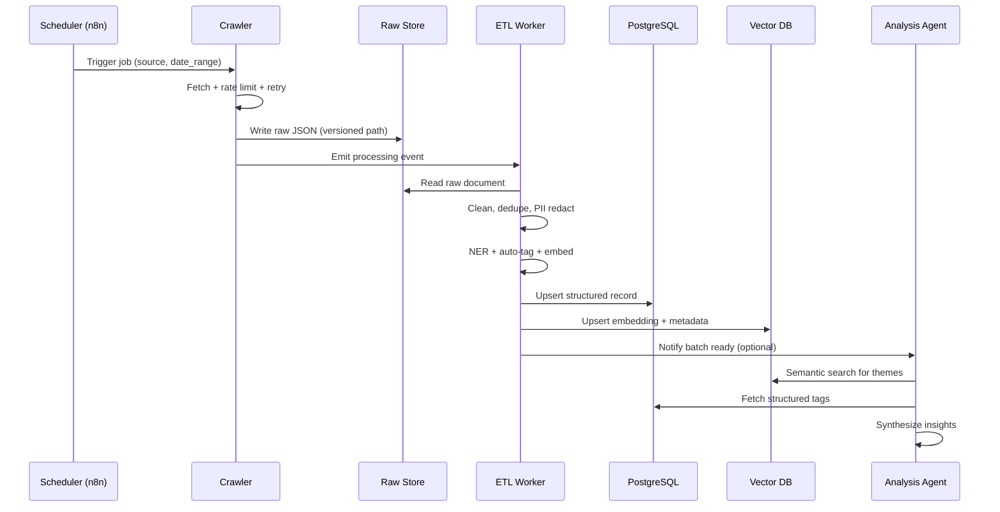
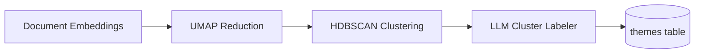
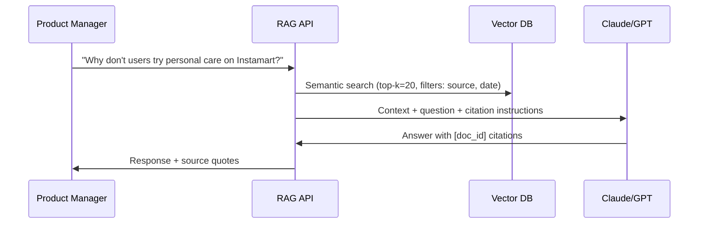
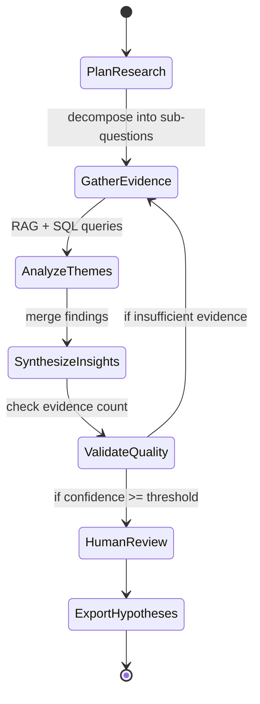
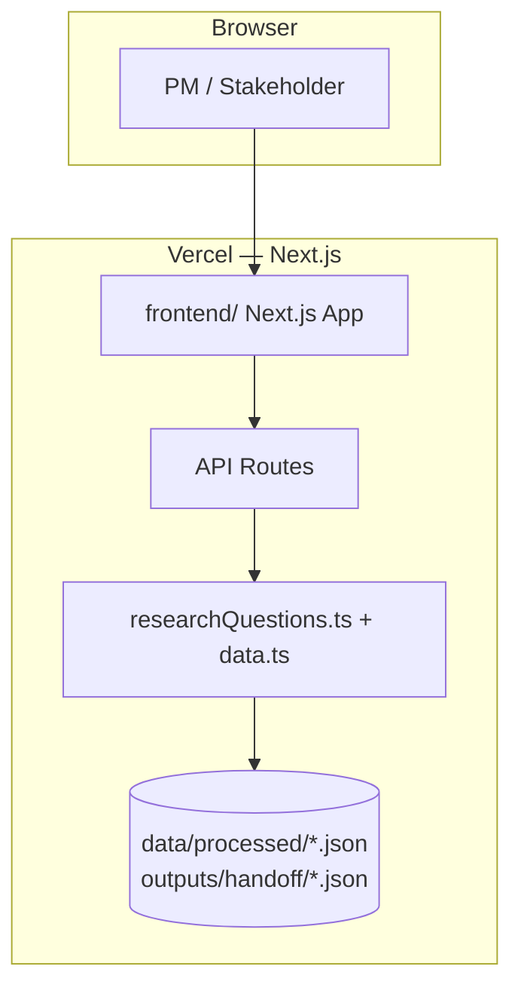

# Phase 1 — AI-Powered Discovery Engine (Detailed Architecture)

## 1. Objective & Scope

Build an AI-native system that ingests and analyzes public user feedback at scale to answer strategic research questions about **category repetition**, **exploration barriers**, and **discovery behavior** on quick-commerce platforms.

### In Scope

- Automated collection from 7+ source types
- Text normalization, enrichment, and semantic indexing
- Theme identification, sentiment analysis, and barrier taxonomy
- RAG-based Q&A and autonomous research agent
- Human-in-the-loop validation of insight quality

### Out of Scope

- Swiggy internal order data (Phase 4 only, with proper access)
- User interviews (Phase 2)
- Product feature implementation (Phase 4)

---

## 2. Research Questions → System Modules

| # | Research Question | Module | Output Artifact |
|---|-------------------|--------|-----------------|
| Q1 | Why do users repeatedly buy from the same categories? | Habit Pattern Analyzer | Theme cluster: "reorder convenience", "mental load" |
| Q2 | What prevents users from exploring new categories? | Barrier Taxonomy Classifier | Ranked barrier list with frequency |
| Q3 | How do users discover products today? | Discovery Path Extractor | Discovery channel map |
| Q4 | What role do habits play in shopping behavior? | Temporal Language Analyzer | Habit-loop narrative summary |
| Q5 | What information do users need before trying a new category? | Information-Gap Tagger | Pre-purchase info checklist |
| Q6 | What frustrations emerge repeatedly? | Frustration Spike Detector | Top-10 frustration themes |
| Q7 | Which user segments are more likely to experiment? | Segment Tagger | Segment × experiment likelihood matrix |
| Q8 | What unmet needs emerge consistently? | Need-State Clusterer | Opportunity areas ranked by volume |

---

## 3. High-Level Architecture



---

## 4. Data Source Connectors (Detailed)

### 4.1 App Store & Play Store Reviews

| Attribute | Detail |
|-----------|--------|
| **Tool** | Apify actors (`apple-app-store-scraper`, `google-play-scraper`) or SerpAPI |
| **Target apps** | Swiggy, Instamart, Zepto, Blinkit, BigBasket |
| **Fields collected** | `review_id`, `rating`, `title`, `body`, `date`, `app_version`, `source` |
| **Schedule** | Daily incremental pull (last 7 days) + weekly full backfill (90 days) |
| **Volume estimate** | 200–500 reviews/week across apps |

### 4.2 Reddit

| Attribute | Detail |
|-----------|--------|
| **Tool** | Reddit API (PRAW) or Pushshift archive |
| **Subreddits** | r/india, r/bangalore, r/mumbai, r/delhi, r/Instacart-style subs, brand-specific |
| **Search queries** | "instamart", "zepto", "blinkit", "quick commerce", "grocery delivery habit" |
| **Fields** | `post_id`, `subreddit`, `title`, `body`, `score`, `num_comments`, `created_utc` |
| **Schedule** | Daily |

### 4.3 Community Forums & Social

| Attribute | Detail |
|-----------|--------|
| **Forums** | Quora, MouthShut, Team-BHP (relevant threads), local Facebook groups (manual export) |
| **Social** | X/Twitter search API, YouTube comment scraper for review videos |
| **Schedule** | Weekly batch |

### 4.4 Product & QC Discussions

| Attribute | Detail |
|-----------|--------|
| **Sources** | Amazon/Flipkart reviews mentioning delivery apps, blog posts, comparison articles |
| **Tool** | Custom scraper + Perplexity API for discovery of new URLs |
| **Schedule** | Weekly |

---

## 5. Ingestion Pipeline — Sequence



---

## 6. Data Model (Phase 1)

### 6.1 `documents` table

```sql
CREATE TABLE documents (
    id              UUID PRIMARY KEY DEFAULT gen_random_uuid(),
    source_type     VARCHAR(50) NOT NULL,  -- app_store, play_store, reddit, forum, social
    source_id       VARCHAR(255) NOT NULL,   -- platform-native ID
    source_url      TEXT,
    app_name        VARCHAR(100),            -- swiggy, zepto, blinkit, etc.
    title           TEXT,
    body            TEXT NOT NULL,
    rating          SMALLINT,                -- 1-5 if applicable
    author_hash     VARCHAR(64),             -- hashed, not raw username
    published_at    TIMESTAMPTZ,
    ingested_at     TIMESTAMPTZ DEFAULT NOW(),
    language        VARCHAR(10),
    dedupe_hash     VARCHAR(64) UNIQUE,
    raw_path        TEXT,                    -- S3 key
    UNIQUE (source_type, source_id)
);
```

### 6.2 `document_tags` table

```sql
CREATE TABLE document_tags (
    document_id     UUID REFERENCES documents(id),
    tag_type        VARCHAR(50),   -- barrier, segment, discovery_path, frustration, category
    tag_value       VARCHAR(255),
    confidence      FLOAT,
    PRIMARY KEY (document_id, tag_type, tag_value)
);
```

### 6.3 `themes` table

```sql
CREATE TABLE themes (
    id              UUID PRIMARY KEY,
    label           VARCHAR(255) NOT NULL,
    description     TEXT,
    cluster_id      INTEGER,
    document_count  INTEGER,
    avg_sentiment   FLOAT,
    research_question VARCHAR(10),  -- Q1-Q8 mapping
    created_at      TIMESTAMPTZ DEFAULT NOW()
);
```

### 6.4 `insights` table

```sql
CREATE TABLE insights (
    id              UUID PRIMARY KEY,
    theme_id        UUID REFERENCES themes(id),
    statement       TEXT NOT NULL,           -- atomic insight claim
    evidence_count  INTEGER,
    confidence      VARCHAR(20),             -- high, medium, low
    validation_status VARCHAR(20) DEFAULT 'pending',  -- pending, approved, rejected
    reviewer_notes  TEXT,
    created_at      TIMESTAMPTZ DEFAULT NOW()
);
```

### 6.5 `insight_evidence` table

```sql
CREATE TABLE insight_evidence (
    insight_id      UUID REFERENCES insights(id),
    document_id     UUID REFERENCES documents(id),
    quote_span      TEXT NOT NULL,           -- exact excerpt
    relevance_score FLOAT,
    PRIMARY KEY (insight_id, document_id)
);
```

---

## 7. Processing Pipeline (Step-by-Step)

### Step 1 — Clean & Dedupe

```python
# Pseudocode
def process_document(raw: dict) -> Document:
    text = normalize_unicode(raw["body"])
    text = strip_html(text)
    text = collapse_whitespace(text)
    dedupe_hash = sha256(f"{raw['source_type']}:{text[:500]}")
    if exists(dedupe_hash):
        return None  # skip duplicate
    return Document(...)
```

- Remove boilerplate ("Great app!", emoji spam)
- Near-duplicate detection: cosine similarity > 0.95 on embeddings → merge

### Step 2 — Language & PII

- Filter: English and Hindi (configurable)
- Redact: phone numbers, emails, addresses via regex + NER

### Step 3 — Entity Extraction

| Entity Type | Examples | Model |
|-------------|----------|-------|
| `category` | groceries, snacks, personal care, pet supplies | LLM structured output |
| `brand` | Amul, Dove, Pedigree | NER |
| `competitor` | Zepto, Blinkit, Amazon | Keyword + LLM |
| `barrier` | trust, price, discovery, habit | Classifier prompt |
| `segment_signal` | student, parent, pet owner | Classifier prompt |

### Step 4 — Embedding

- Model: `text-embedding-3-small` or `voyage-3`
- Chunking: 512 tokens, 50-token overlap for long posts
- Store: vector + `{document_id, chunk_index, tags}` metadata

---

## 8. AI Analysis Layer

### 8.1 Theme Clustering



- **Input:** All document embeddings from QC-relevant corpus
- **Output:** 15–30 theme clusters with human-readable labels
- **LLM labeling prompt:** "Given these 10 representative quotes, name the theme in ≤8 words and write a 2-sentence description"

### 8.2 Barrier Taxonomy Classifier

Predefined taxonomy (extensible):

| Barrier Code | Description |
|--------------|-------------|
| `B1_habit` | Reorder / routine lock-in |
| `B2_trust` | Quality uncertainty for unfamiliar categories |
| `B3_discovery` | Can't find or doesn't know category exists |
| `B4_price` | Perceived poor value vs alternatives |
| `B5_cognitive_load` | Too many choices, decision fatigue |
| `B6_delivery` | Concerns about freshness, returns, SLA |
| `B7_social` | No reviews, ratings, or social proof |

Each document can have multiple barriers with confidence scores.

### 8.3 RAG Q&A Service



**RAG rules:**
- Always cite ≥3 source documents
- Refuse to answer if retrieval confidence < threshold
- Include sentiment breakdown in response

### 8.4 Research Agent (LangGraph)



**Agent tools:**
1. `search_corpus(query, filters)` — vector search
2. `query_tags(tag_type, tag_value)` — SQL aggregation
3. `get_theme_details(theme_id)` — cluster stats
4. `compare_segments(segment_a, segment_b)` — diff barriers
5. `export_hypothesis(statement, evidence_ids)` — write to Phase 2 backlog

---

## 9. n8n Workflow Design (Alternative Orchestration)

### Workflow A — Daily Ingestion

```
[Cron 06:00 IST]
  → [Parallel: App Store, Play Store, Reddit jobs]
  → [Wait for all]
  → [Trigger ETL webhook]
  → [Slack notification: docs ingested count]
```

### Workflow B — Weekly Insight Refresh

```
[Cron Sunday 08:00]
  → [Run clustering job]
  → [Run agent synthesis]
  → [Generate research brief draft]
  → [Email PM + link to review dashboard]
```

---

## 10. Insight Quality Validation

### 10.1 Automated Checks

| Check | Rule | Action if Fail |
|-------|------|----------------|
| Evidence minimum | ≥3 unique documents per insight | Flag for agent re-run |
| Source diversity | ≥2 source types per insight | Lower confidence |
| Quote fidelity | Quote substring exists in source | Reject insight |
| Hallucination | LLM claim not in retrieved context | Reject insight |
| Recency | ≥30% evidence from last 90 days | Note staleness |

### 10.2 Human Review Process

1. PM reviews top-20 insights in dashboard
2. For each: Approve / Reject / Edit
3. Second reviewer (peer) on top-10 → Cohen's kappa ≥ 0.8
4. Approved insights → `validation_status = 'approved'`

### 10.3 Validation Report Template

```markdown
## Insight Validation Report — Phase 1

**Corpus stats:** {N} documents, {M} source types, date range {start}–{end}
**Themes identified:** {count}
**Insights generated:** {count} | Approved: {count} | Rejected: {count}
**Inter-rater agreement (top-10):** κ = {value}
**Limitations:** {sampling bias, language bias, platform bias}
**Recommended segment for Phase 2:** {segment} — rationale: {evidence}
```

---

## 11. Output Artifacts

### 11.1 Research Brief (Structure)

1. Executive summary (≤200 words)
2. Methodology (sources, volume, AI stack)
3. Top themes by research question (Q1–Q8)
4. Barrier frequency chart
5. Segment opportunity matrix
6. Hypothesis backlog for Phase 2 (10–15 items)
7. Appendix: sample quotes per theme

### 11.2 Dashboard Views

| View | Contents |
|------|----------|
| **Corpus overview** | Doc count by source, timeline, language split |
| **Theme explorer** | Cluster labels, drill-down to quotes |
| **Barrier heatmap** | Barrier × segment matrix |
| **Ask the corpus** | RAG chat interface |
| **Review queue** | Pending insights for human approval |

---

## 12. Tech Stack Recommendation

| Layer | Technology | Rationale |
|-------|------------|-----------|
| Orchestration | n8n (self-hosted) or Temporal | Visual workflows, retries |
| Crawlers | Apify + PRAW + custom Python | Pre-built actors for app stores |
| ETL | Python 3.11, pandas, spaCy | Flexible NLP pipeline |
| DB | PostgreSQL 15 + pgvector | Single store for structured + vectors |
| Blob | AWS S3 / MinIO | Cheap raw storage |
| Embeddings | OpenAI / Voyage | Quality vs cost balance |
| LLM | Claude 3.5 Sonnet / GPT-4o | Analysis + synthesis |
| Agent | LangGraph | Stateful multi-step research |
| Dashboard | Streamlit or Retool | Fast PM-facing UI |
| Queue | Redis + Celery | Async ETL jobs |

---

## 13. Non-Functional Requirements

| NFR | Target |
|-----|--------|
| Ingestion latency | New reviews available within 24h of publish |
| ETL throughput | 1,000 docs/hour |
| RAG response time | < 5 seconds p95 |
| Data retention (raw) | 90 days |
| Uptime (dashboard) | 99% (internal tool) |
| Cost cap | < $200/month for LLM + infra at MVP scale |

---

## 14. Phase 1 → Phase 2 Handoff Package

```
phase1-discovery/outputs/handoff/
├── research-brief.md
├── validation-report.md
├── hypothesis-backlog.json      # structured for Phase 2
├── segment-candidates.json      # ranked segments with evidence
├── top-quotes-by-theme/         # CSV per theme
└── dashboard-export/            # snapshot charts
```

### `hypothesis-backlog.json` schema

```json
{
  "hypotheses": [
    {
      "id": "HYP-001",
      "statement": "Weekly grocery reorders create a habit loop that prevents users from browsing non-grocery categories",
      "research_question": "Q1",
      "theme_id": "uuid",
      "evidence_document_ids": ["uuid1", "uuid2", "uuid3"],
      "confidence": "high",
      "suggested_interview_probe": "Walk me through your last 3 Instamart orders. Did you browse anything outside groceries?"
    }
  ]
}
```

---

## 15. Success Criteria & Exit Gate

| Criterion | Threshold | Verification |
|-----------|-----------|--------------|
| Source diversity | ≥3 source types | DB query |
| Corpus size | ≥500 relevant docs | Filtered count |
| Theme coverage | All Q1–Q8 have ≥1 theme | Mapping table |
| Insight traceability | 100% approved insights have ≥3 quotes | Automated check |
| Human agreement | κ ≥ 0.8 on top-10 | Inter-rater calc |
| Hypothesis backlog | ≥10 testable hypotheses | JSON export |

**Exit gate:** PM sign-off on research brief + approved hypothesis backlog before Phase 2 recruitment begins.

---

## 16. Deployment Architecture

**Live demo:** https://swiggy-instamart-order-discovery-en.vercel.app/

Phase 1 deploys as a **Next.js app on Vercel**. The dashboard (35/65 layout, Q1–Q8, RAG) is the production surface.

### 16.1 Deployment Topology



### 16.2 Component Responsibilities

| Component | Path | Role |
|-----------|------|------|
| **Next.js frontend** | `phase1-discovery/frontend/` | Dashboard UI, Live Workflow, RAG |
| **API layer** | `frontend/app/api/*` | stats, research-questions, rag |
| **Processed data** | `data/processed/` | Runtime corpus |
| **Handoff** | `outputs/handoff/` | Hypotheses, Phase 1 summary |

### 16.3 Vercel deploy

| Step | Action |
|------|--------|
| 1 | Import repo on [vercel.com/new](https://vercel.com/new) |
| 2 | Root directory: `phase1-discovery/frontend` |
| 3 | Deploy — no env vars required for read-only JSON MVP |
| 4 | Live: https://swiggy-instamart-order-discovery-en.vercel.app/ |

**Local:** `cd frontend && npm run dev` → http://localhost:3000

See [`phase1-discovery/frontend/README.md`](../../phase1-discovery/frontend/README.md).

### 16.4 Pre-deployment checklist

| Check | Verification |
|-------|--------------|
| Corpus present | `data/processed/*_processed.json` — 3,194 docs |
| Handoff present | `outputs/handoff/hypothesis-backlog.json` |
| Next.js build | `npm run build` exits 0 |
| API smoke test | `GET /api/stats`, `GET /api/research-questions?source=reddit` |

### 16.5 Operational notes

- **Data refresh:** Re-run pipeline scripts, then redeploy Vercel.  
- **No database:** MVP reads flat JSON at API runtime.  
- **Optional env:** `GROQ_API_KEY` in `.env` for ingestion only (not required for dashboard).

---

*Presentation summary for stakeholders: [`doc/phase1-discovery-engine-summary.md`](../phase1-discovery-engine-summary.md)*
