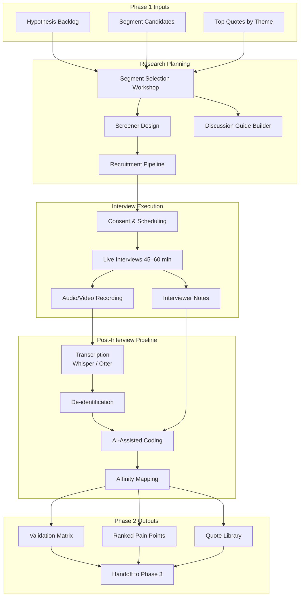
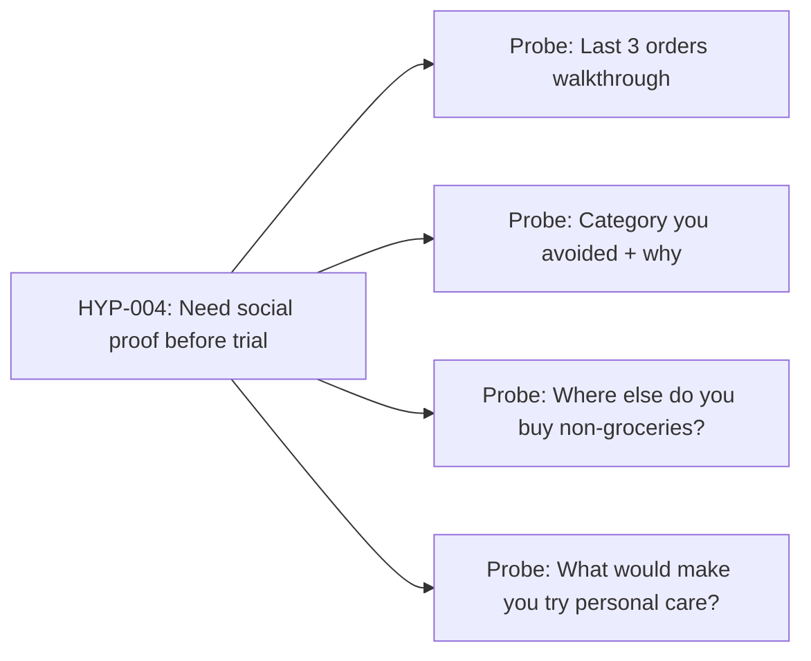
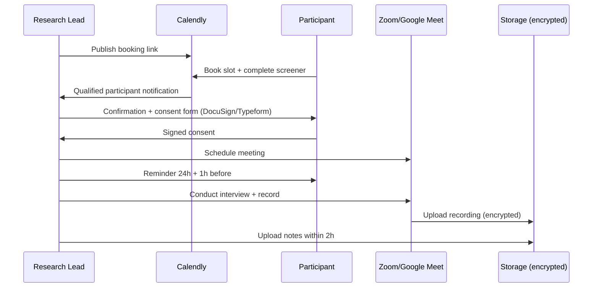
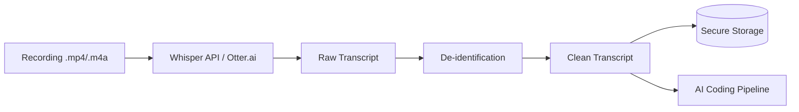
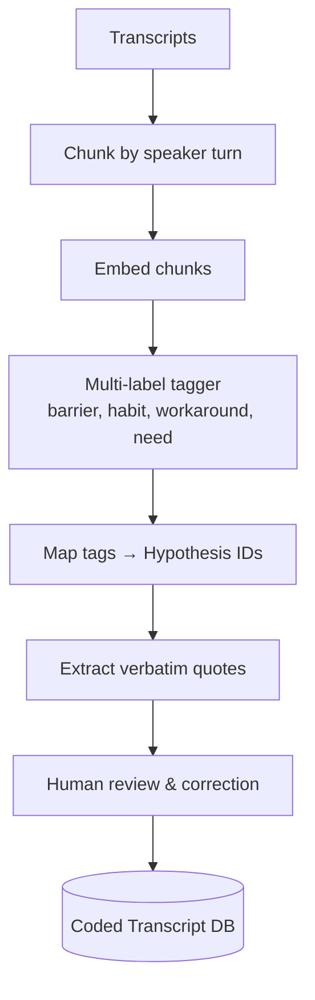

# Phase 2 — User Research Validation (Detailed Architecture)

## 1. Objective & Scope

Validate, refine, or reject AI-generated insights from Phase 1 through **5–6 semi-structured user interviews** with a narrowly defined target segment. This phase ensures MVP direction is grounded in primary research, not synthetic analysis alone.

### In Scope

- Segment selection and screening
- Discussion guide design tied to hypothesis backlog
- Interview recruitment, execution, transcription
- AI-assisted coding and affinity synthesis
- Validation matrix (Confirmed / Challenged / New)

### Out of Scope

- Quantitative surveys at scale
- MVP building
- Internal Swiggy analytics (unless available via stakeholder)

---

## 2. Architecture Overview



---

## 3. Segment Selection Framework

### 3.1 Scoring Model

Rank Phase 1 segment candidates using weighted criteria:

| Criterion | Weight | Data Source |
|-----------|--------|-------------|
| Evidence volume in corpus | 25% | Phase 1 theme × segment tags |
| Business impact (order frequency) | 25% | Stakeholder input / proxy data |
| Barrier clarity (well-defined pain) | 20% | Phase 1 barrier heatmap |
| Reachability for interviews | 15% | Recruitment feasibility |
| MVP testability | 15% | Can we nudge this segment in Phase 4? |

### 3.2 Recommended Primary Segment (Illustrative)

**"Habitual Grocery Repeaters"**

| Attribute | Definition |
|-----------|------------|
| **Behavior** | 2+ Instamart orders/month for 3+ months |
| **Category pattern** | ≥80% spend in groceries + snacks/beverages |
| **Exploration gap** | Zero purchases in personal care, pet, or baby categories |
| **Demographics** | Urban, 25–40, smartphone-native |
| **Size proxy** | High-frequency Instamart core segment |

### 3.3 Secondary Segment (Backup)

**"Single-Category Snack Buyers"** — users who only buy snacks/beverages, never household or personal care.

---

## 4. Hypothesis Backlog → Interview Mapping

Each hypothesis from Phase 1 maps to interview probes:



### Hypothesis Tracking Table

| Hypothesis ID | Statement | Interview Section | Success Signal |
|---------------|-----------|-------------------|----------------|
| HYP-001 | Reorder habit prevents browsing | Ordering habits | ≥4/6 describe repeat basket |
| HYP-002 | Trust barrier on quality | Barriers | ≥4/6 mention quality uncertainty |
| HYP-003 | Off-platform for non-groceries | Workarounds | ≥3/6 use Amazon/local |
| HYP-004 | Need reviews/ratings | Ideal support | ≥4/6 ask for social proof |
| HYP-005 | Cognitive overload in catalog | Discovery | ≥3/6 mention too many choices |

---

## 5. Screening Screener Design

### 5.1 Qualification Questions

| # | Question | Pass Criteria |
|---|----------|---------------|
| Q1 | How often do you order from Instamart? | ≥2 times/month |
| Q2 | Which categories do you regularly buy? (multi-select) | Groceries and/or snacks selected |
| Q3 | Which have you NEVER bought on Instamart? (multi-select) | Personal care OR pet OR baby selected |
| Q4 | Do you use other apps for those categories? | Any answer (capture workaround) |
| Q5 | Age range | 22–45 |
| Q6 | City | Tier 1 metro |
| Q7 | Willing to 45-min video call? | Yes |

### 5.2 Disqualifiers

- Never used Instamart
- Uses Instamart <1x/month
- Already buys across 4+ categories on Instamart (not the target problem)

### 5.3 Recruitment Channels

| Channel | Tool | Target |
|---------|------|--------|
| UserInterviews.com | Panel | 3 participants |
| Swiggy internal panel (if available) | Stakeholder | 2 participants |
| LinkedIn / community outreach | Manual | 1 participant |
| Referrals from participants | Snowball | 0–1 participants |

**Incentive:** ₹1,500–2,000 gift voucher per 60-min session

---

## 6. Discussion Guide Architecture

### 6.1 Session Structure (60 minutes)

| Block | Duration | Purpose |
|-------|----------|---------|
| Warm-up & consent | 5 min | Rapport, recording consent |
| Instamart usage overview | 10 min | Frequency, categories, role in life |
| Last orders deep-dive | 15 min | Habit evidence, reorder behavior |
| Category exploration | 15 min | Barriers, past attempts, failures |
| Workarounds & alternatives | 10 min | Amazon, local stores, other apps |
| Ideal discovery experience | 10 min | Concept reaction (no leading) |
| Wrap-up | 5 min | Anything missed, thank you |

### 6.2 Core Questions (Non-Leading)

1. "Tell me about the last time you ordered from Instamart. What was in your cart?"
2. "Is there anything you buy regularly elsewhere that you've never bought on Instamart? Why?"
3. "Have you ever browsed a category on Instamart and decided not to buy? What happened?"
4. "What would need to be true for you to try [personal care / pet supplies] on Instamart?"
5. "If Instamart suggested one new category based on what you already buy, how would you feel?"
6. "What would make that suggestion helpful vs. annoying?"

### 6.3 Concept Stimulus (Optional, Block 5)

Show lo-fi mock of "Category Bridge" widget (static Figma) — observe reactions without pitching.

---

## 7. Interview Operations System



### 7.1 Consent Requirements

- Purpose of research stated clearly
- Recording permission explicit
- Right to withdraw
- Anonymization commitment
- Data retention period (e.g., 12 months)

### 7.2 Interviewer Protocol

- One lead interviewer, one silent note-taker (optional)
- Do not lead with solutions
- Probe with "Tell me more" and "Why?"
- Capture exact phrases for quote library

---

## 8. Transcription & De-identification Pipeline



### 8.1 De-identification Rules

| Element | Action |
|---------|--------|
| Name | Replace with `[Participant-N]` |
| Address | Remove |
| Phone/email | Remove |
| Employer (if identifying) | Generalize to industry |
| Specific locality | Generalize to city zone |

### 8.2 Transcript Metadata

```json
{
  "interview_id": "INT-001",
  "participant_id": "P-001",
  "date": "2026-02-15",
  "duration_minutes": 58,
  "segment": "habitual_grocery_repeater",
  "interviewer": "PM Name",
  "transcript_path": "transcripts/INT-001.md",
  "recording_path": "recordings/INT-001.enc",
  "consent_signed": true
}
```

---

## 9. AI-Assisted Coding Pipeline

### 9.1 Architecture



### 9.2 Coding Taxonomy

| Code | Description | Example Quote |
|------|-------------|---------------|
| `HABIT_REORDER` | Repeat same basket | "I just hit reorder every Sunday" |
| `BARRIER_TRUST` | Quality uncertainty | "I don't know if shampoo here is genuine" |
| `WORKAROUND_AMAZON` | Uses other platform | "I get personal care from Amazon only" |
| `NEED_SOCIAL_PROOF` | Wants reviews/ratings | "Show me what's popular with people like me" |
| `NEED_LOW_RISK` | Small trial preference | "I'd try a small pack first" |
| `FRICTION_DISCOVERY` | Can't find categories | "I didn't know Instamart sells pet food" |
| `POSITIVE_NUDGE` | Open to suggestions | "If it matched what I buy, I'd look" |
| `NEGATIVE_NUDGE` | Annoyed by suggestions | "Don't push stuff when I'm in a hurry" |

### 9.3 LLM Coding Prompt (Structured Output)

```
Analyze this interview excerpt. Return JSON:
{
  "codes": ["HABIT_REORDER", "BARRIER_TRUST"],
  "hypothesis_ids": ["HYP-001", "HYP-002"],
  "quote": "exact verbatim span",
  "sentiment": "negative|neutral|positive",
  "severity": 1-5
}
```

Human reviewer validates 100% of codes for first 2 transcripts, then spot-checks 50% thereafter.

---

## 10. Affinity Synthesis & Validation Matrix

### 10.1 Affinity Mapping Process

1. Export all coded quotes to Miro/FigJam
2. Cluster by similarity (manual + AI-suggested groupings)
3. Name clusters (e.g., "Trust without trial", "Reorder autopilot")
4. Rank clusters by frequency (across 5–6 interviews) and severity (avg 1–5)

### 10.2 Validation Matrix Schema

```json
{
  "validation_matrix": [
    {
      "hypothesis_id": "HYP-001",
      "phase1_statement": "Reorder habit prevents category exploration",
      "status": "confirmed",
      "evidence_count": 5,
      "supporting_quotes": ["INT-001:L42", "INT-003:L18"],
      "notes": "Strong consensus; 5/6 participants describe weekly reorder"
    },
    {
      "hypothesis_id": "HYP-002",
      "phase1_statement": "Trust gap on unfamiliar categories",
      "status": "confirmed",
      "evidence_count": 4,
      "supporting_quotes": ["INT-002:L55"],
      "notes": "Personal care and pet food most cited"
    },
    {
      "hypothesis_id": "HYP-006",
      "phase1_statement": "Users want category-level bundles",
      "status": "new",
      "evidence_count": 3,
      "supporting_quotes": ["INT-004:L30"],
      "notes": "Not in Phase 1 corpus; emerged in interviews"
    }
  ]
}
```

### 10.3 Status Definitions

| Status | Definition |
|--------|------------|
| **Confirmed** | ≥4/6 interviews support; aligns with Phase 1 |
| **Partially confirmed** | 2–3/6 support; nuance added |
| **Challenged** | ≤1/6 support OR direct contradiction |
| **New** | Not in Phase 1; emerged in interviews ≥3 times |

---

## 11. Pain Point Ranking Model

```
Pain Score = (Frequency / N_interviews) × 0.5 + (Avg Severity / 5) × 0.3 + (Business Impact) × 0.2
```

| Rank | Pain Point | Frequency | Severity | Phase 1 Link |
|------|------------|-----------|----------|--------------|
| 1 | Reorder autopilot blocks discovery | 5/6 | 4.2 | HYP-001 |
| 2 | Trust gap on non-grocery quality | 4/6 | 4.5 | HYP-002 |
| 3 | Off-platform workaround entrenched | 4/6 | 3.8 | HYP-003 |
| 4 | Need social proof before trial | 4/6 | 4.0 | HYP-004 |
| 5 | Unaware of available categories | 3/6 | 3.5 | New |

---

## 12. Data Model (Phase 2)

### 12.1 `interviews` table

```sql
CREATE TABLE interviews (
    id              VARCHAR(20) PRIMARY KEY,  -- INT-001
    participant_id  VARCHAR(20) NOT NULL,
    segment         VARCHAR(100) NOT NULL,
    conducted_at    TIMESTAMPTZ NOT NULL,
    duration_min    INTEGER,
    interviewer     VARCHAR(100),
    transcript_path TEXT,
    recording_path  TEXT,
    consent_signed  BOOLEAN DEFAULT FALSE
);
```

### 12.2 `coded_segments` table

```sql
CREATE TABLE coded_segments (
    id              UUID PRIMARY KEY,
    interview_id    VARCHAR(20) REFERENCES interviews(id),
    line_ref        VARCHAR(20),       -- L42
    quote           TEXT NOT NULL,
    codes           TEXT[],              -- array of code strings
    hypothesis_ids  TEXT[],
    severity        SMALLINT CHECK (severity BETWEEN 1 AND 5),
    reviewer        VARCHAR(100),
    reviewed_at     TIMESTAMPTZ
);
```

### 12.3 `validation_matrix` table

```sql
CREATE TABLE validation_matrix (
    hypothesis_id   VARCHAR(20) PRIMARY KEY,
    phase1_statement TEXT,
    status          VARCHAR(30),  -- confirmed, partially_confirmed, challenged, new
    evidence_count  INTEGER,
    notes           TEXT,
    updated_at      TIMESTAMPTZ DEFAULT NOW()
);
```

---

## 13. Tooling Stack

| Function | Tool | Notes |
|----------|------|-------|
| Screener | Typeform / Google Forms | Logic branching |
| Scheduling | Calendly | Timezone-aware |
| Video | Zoom / Google Meet | Cloud recording |
| Transcription | Whisper API / Otter.ai | Hindi-English code-switch handling |
| Coding assist | Claude / GPT + custom script | Structured JSON output |
| Synthesis | Miro / FigJam | Affinity mapping |
| Storage | Encrypted Google Drive / S3 | Access restricted to research team |
| Analysis | Notion / Airtable | Validation matrix tracking |

---

## 14. Deliverables Checklist

- [ ] Segment definition document (1 page)
- [ ] Screener (live link + export of qualified responses)
- [ ] Discussion guide (final version used in sessions)
- [ ] 5–6 signed consent forms
- [ ] 5–6 de-identified transcripts
- [ ] Coded transcript database
- [ ] Validation matrix (JSON + summary table)
- [ ] Top 5 ranked pain points with quotes
- [ ] Concept reaction notes (if stimulus shown)
- [ ] Phase 2 synthesis report (3–5 pages)

---

## 15. Success Criteria & Exit Gate

| Criterion | Threshold |
|-----------|-----------|
| Interviews completed | 5–6 with qualified segment |
| Guide coverage | ≥70% of planned topics covered per session |
| Hypothesis coverage | 100% of top-10 hypotheses have a status |
| Confirmed insights | ≥3 hypotheses confirmed with ≥4/6 evidence |
| New insights captured | ≥1 new theme with ≥3/6 evidence |
| Human coding review | 100% of AI codes reviewed |

**Exit gate:** Validation matrix approved by PM + synthesis report shared before Phase 3 workshop.

---

## 16. Phase 2 → Phase 3 Handoff Package

```
phase2-research/outputs/handoff/
├── segment-definition.md
├── validation-matrix.json
├── pain-point-rankings.json
├── synthesis-report.md
├── quote-library/              # Top quotes per pain point
│   ├── pain-01-reorder-autopilot.md
│   └── pain-02-trust-gap.md
└── concept-reactions.md        # If stimulus tested
```
