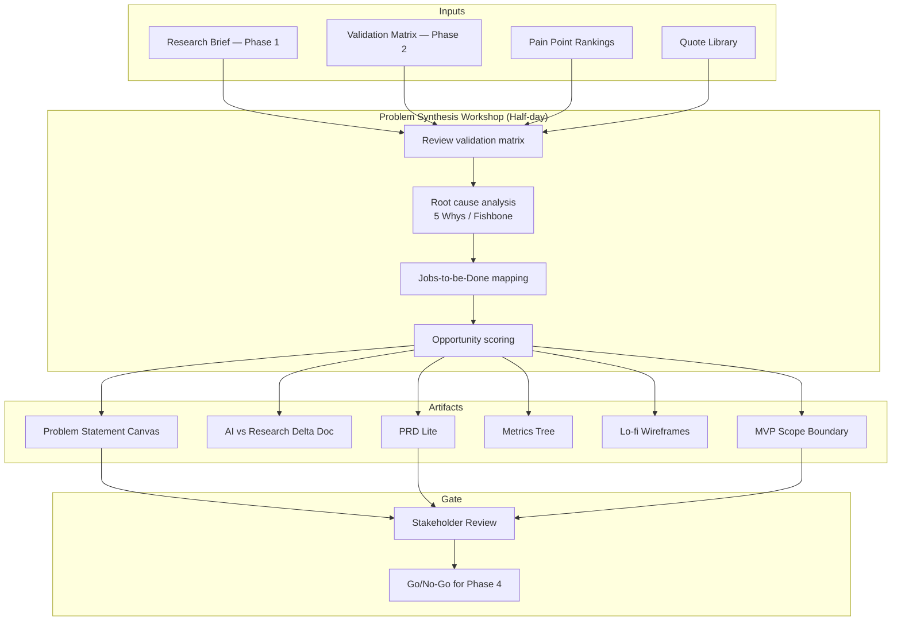
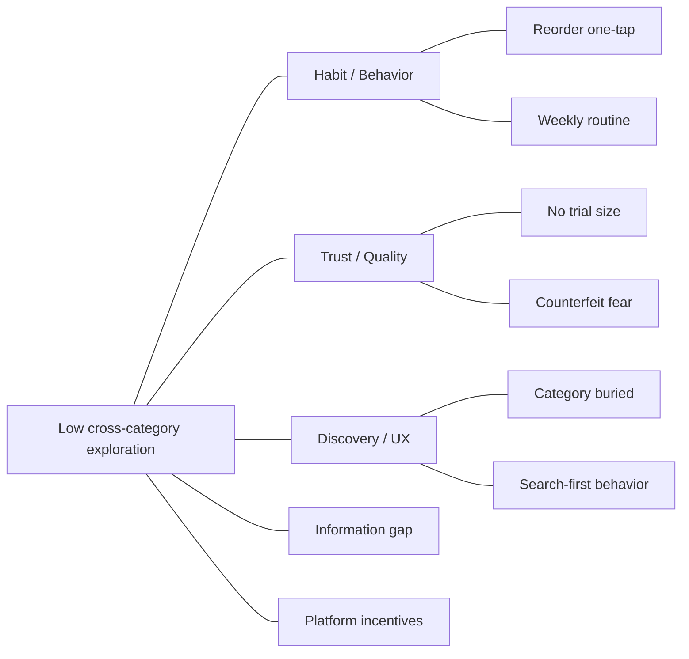
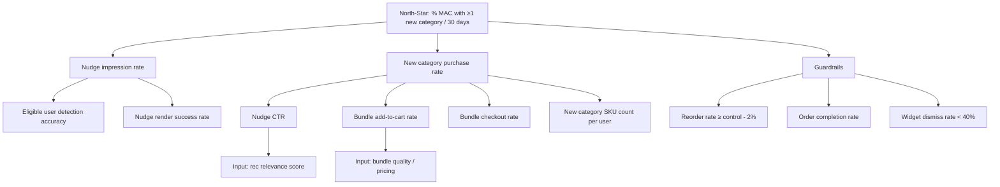

# Phase 3 — Problem Definition (Detailed Architecture)

## 1. Objective & Scope

Synthesize Phase 1 (AI insights) and Phase 2 (validated research) into a **problem statement**, **PRD lite**, and **MVP scope boundary** that directly informs Phase 4 build decisions.

### In Scope

- Problem Statement Canvas (5 required fields from brief)
- AI vs. research delta documentation
- User stories and acceptance criteria
- Metrics tree and experiment hypotheses
- In/out scope for MVP

### Out of Scope

- Full enterprise PRD
- Engineering implementation
- Visual design system (beyond lo-fi wireframes)

---

## 2. Architecture Overview



---

## 3. Problem Synthesis Workshop Design

### 3.1 Participants

| Role | Responsibility |
|------|----------------|
| Product Manager (lead) | Facilitate, own problem statement |
| Research synthesizer | Present Phase 2 findings |
| Engineering representative | Feasibility gut-check |
| Design representative | Wireframe sketching |
| Data/analytics (optional) | Metrics tree validation |

### 3.2 Agenda (4 hours)

| Time | Activity | Output |
|------|----------|--------|
| 0:00–0:30 | Phase 1 + Phase 2 recap | Shared understanding |
| 0:30–1:00 | Validation matrix review | Confirmed/challenged list |
| 1:00–1:45 | Root cause analysis (5 Whys) | Root cause statement |
| 1:45–2:15 | JTBD mapping | Primary job + obstacles |
| 2:15–2:45 | Opportunity solution tree | Solution directions ranked |
| 2:45–3:30 | Problem canvas drafting | Draft canvas v1 |
| 3:30–4:00 | MVP scope + metrics | Scope boundary + PRD outline |

---

## 4. Root Cause Analysis Framework

### 4.1 Five Whys (Example)

```
Problem: Users don't buy personal care on Instamart

Why 1? → They reorder groceries and don't browse other categories
Why 2? → Reorder is fast and meets their immediate need
Why 3? → They don't trust quality for categories they haven't tried here
Why 4? → No social proof or trial-friendly options for unfamiliar categories
Why 5? → Platform optimizes for speed of repeat purchase, not discovery

ROOT CAUSE: Habit-optimized reorder flow + trust gap for adjacent categories
```

### 4.2 Fishbone Diagram Categories



---

## 5. Problem Statement Canvas (Required Fields)

### 5.1 Template

```markdown
# Problem Statement — Swiggy Instamart New Category Discovery

## 1. Target User Segment
**Who:** [Specific, observable definition]
**Size proxy:** [How many users fit this segment]
**Why this segment:** [Evidence from Phase 1 + 2]

## 2. Root Cause
**Primary cause:** [One sentence]
**Contributing factors:** [Bulleted list with evidence]
**5 Whys summary:** [Chain]

## 3. Existing User Workarounds
| Workaround | Frequency (interviews) | Why it persists |
|------------|------------------------|-----------------|
| ... | ... | ... |

## 4. User Value (Why solve this?)
- [Value 1 — with quote]
- [Value 2 — with quote]
- [Value 3 — with quote]

## 5. Business Value (Why it matters to Swiggy?)
- North-star impact: [How this moves MAC new-category %]
- Revenue: [Adjacent category AOV opportunity]
- Retention: [Cross-category correlates with retention — cite if available]
- Strategic: [Category penetration goals]

## 6. AI vs. Primary Research Delta
| Theme | Phase 1 (AI) | Phase 2 (Research) | Status |
|-------|--------------|-------------------|--------|
| ... | ... | ... | Confirmed / Challenged / New |
```

### 5.2 Worked Example (Based on Typical Findings)

```markdown
## 1. Target User Segment
**Who:** Urban Instamart users, 25–40, ordering 2+ times/month for 3+ months,
       with ≥80% spend in groceries/snacks and zero purchases in personal care,
       pet supplies, or baby products.
**Size proxy:** Core high-frequency segment (estimated 15–25% of MAC).
**Why this segment:** Highest order frequency + clearest exploration gap + 
       5/6 interviews confirmed reorder autopilot behavior.

## 2. Root Cause
**Primary cause:** The reorder-optimized shopping flow creates a habit loop that
       bypasses category discovery, compounded by trust gaps for unfamiliar
       non-grocery categories.
**Contributing factors:**
- One-tap reorder removes browsing trigger (5/6 interviews)
- Quality uncertainty for personal care (4/6)
- Off-platform workaround entrenched via Amazon (4/6)
- Unaware Instamart carries some adjacent categories (3/6)

## 3. Existing User Workarounds
| Workaround | Frequency | Why it persists |
|------------|-----------|-----------------|
| Amazon for personal care | 4/6 | Trust, reviews, returns |
| Local kirana for pet food | 2/6 | Immediate need, known quality |
| Skip category entirely | 3/6 | Not worth cognitive effort |

## 4. User Value
- Discover relevant categories without breaking fast reorder flow
- Reduce decision anxiety via curated starter options
- Save time vs. switching to another app

## 5. Business Value
- Unlock adjacent category GMV from highest-frequency users
- Increase MAC new-category % (north-star)
- Deepen platform stickiness beyond single-category utility

## 6. AI vs. Research Delta
| Theme | Phase 1 | Phase 2 | Status |
|-------|---------|---------|--------|
| Habit loop | Strong in reviews | 5/6 confirmed | Confirmed |
| Trust barrier | Common frustration | 4/6 confirmed | Confirmed |
| Price sensitivity | Moderate theme | 1/6 only | Challenged |
| Starter bundles | Not in corpus | 3/6 suggested | New |
```

---

## 6. Jobs-to-be-Done Mapping

### 6.1 Primary Job

> **When** I'm doing my weekly Instamart grocery run,  
> **I want to** quickly restock my staples without extra decisions,  
> **So I can** save time and maintain my household routine.

### 6.2 Related Job (Opportunity)

> **When** I realize I also need something outside my usual categories,  
> **I want to** confidently try a new category without research overhead,  
> **So I can** get everything in one delivery without opening another app.

### 6.3 Job Map — Pain Points

| Job Step | Pain | Opportunity |
|----------|------|-------------|
| Open app | Goes straight to reorder | Insert discovery moment post-reorder-add |
| Build cart | Same items every time | Detect habitual basket composition |
| Consider new category | Doesn't know what's available | Surface one adjacent category |
| Evaluate quality | No trust signal | Show ratings, "popular with similar buyers" |
| Trial purchase | Full-size commitment scary | Offer 2–3 item starter bundle |
| Checkout | Wants speed | One-tap add bundle |

---

## 7. Solution Opportunity Scoring

| Solution Direction | Impact (1–5) | Confidence (1–5) | Effort (1–5) | Score (I×C/E) |
|--------------------|--------------|------------------|--------------|---------------|
| **Category Bridge widget** | 5 | 4 | 3 | 6.7 |
| Full catalog redesign | 4 | 2 | 5 | 1.6 |
| Push notifications for deals | 3 | 2 | 2 | 3.0 |
| Loyalty rewards for new categories | 4 | 3 | 4 | 3.0 |
| AI shopping assistant (chat) | 4 | 3 | 4 | 3.0 |

**Selected MVP direction:** Category Bridge widget (highest score, validated in concept reactions)

---

## 8. PRD Lite Structure

### 8.1 Document Outline

```markdown
# PRD Lite — Smart Category Bridge MVP

## Overview
- Problem statement (link)
- MVP goal
- Target segment
- Non-goals

## User Stories
### US-001: Contextual category nudge
As a habitual grocery buyer, I want to see one relevant new category suggestion
after adding my usual items, so that I can discover something useful without
extra browsing.

**Acceptance criteria:**
- [ ] Nudge appears when cart matches habitual pattern (≥3 recurring SKUs)
- [ ] Nudge shows exactly one category (not a list)
- [ ] Nudge includes personalized rationale (≤2 sentences)
- [ ] User can dismiss in one tap
- [ ] Nudge does not appear more than once per session

### US-002: Starter bundle
As a hesitant buyer, I want a small curated bundle in the suggested category,
so that I can try without committing to full-size products.

**Acceptance criteria:**
- [ ] Bundle contains 2–3 SKUs
- [ ] All SKUs rated ≥4.0 or marked "popular"
- [ ] Total bundle price displayed
- [ ] One-tap "Add bundle to cart"

### US-003: Feedback
As a user, I want to give quick feedback on the suggestion,
so that future suggestions improve.

**Acceptance criteria:**
- [ ] Thumbs up / thumbs down
- [ ] Optional "Not relevant" / "Already buy elsewhere" reasons
- [ ] Feedback stored with event analytics

## Functional Requirements
| ID | Requirement | Priority |
|----|-------------|----------|
| FR-01 | Habitual cart detection | P0 |
| FR-02 | Category recommendation engine | P0 |
| FR-03 | AI rationale generation | P0 |
| FR-04 | Starter bundle assembly | P0 |
| FR-05 | A/B experiment assignment | P0 |
| FR-06 | Analytics event tracking | P0 |
| FR-07 | Pre-computed recs cache | P1 |

## Non-Goals (Explicit)
- Full catalog browse redesign
- Chat-based shopping assistant
- Push notification campaigns
- Loyalty/rewards program
- Multi-category suggestions per session
- Hindi localization (v1 English only)

## Constraints
- p95 API latency < 800ms for nudge load
- LLM cost < ₹0.50 per nudge impression
- No raw PII in LLM prompts
- Must not reduce reorder completion rate (guardrail)
```

---

## 9. Metrics Tree



### 9.1 Experiment Hypothesis

> **If** we show habitual grocery buyers a single AI-personalized category nudge with a starter bundle at cart-build time,  
> **then** the % of users purchasing from ≥1 new category in 30 days will increase by ≥15% relative to control,  
> **without** degrading reorder completion rate by more than 2%.

### 9.2 Event Tracking Requirements (Preview for Phase 4)

| Event | Properties | Purpose |
|-------|------------|---------|
| `nudge_eligible` | user_id, cart_signature, segment | Funnel top |
| `nudge_shown` | nudge_id, category, rec_score | Impression |
| `nudge_clicked` | nudge_id, category | Engagement |
| `nudge_dismissed` | nudge_id, dismiss_reason | Friction signal |
| `bundle_added` | bundle_id, skus, price | Conversion |
| `new_category_purchased` | category, first_time, order_id | North-star |
| `nudge_feedback` | rating, reason | Model improvement |

---

## 10. MVP Scope Boundary

### 10.1 In Scope (P0)

| Area | Detail |
|------|--------|
| **Segment** | Habitual grocery repeaters (rule-based detection) |
| **Surface** | In-cart widget after habitual pattern detected |
| **Categories** | Personal care, pet supplies, baby products (adjacent to grocery) |
| **Recommendation** | One category + 2–3 SKU bundle per session |
| **AI** | Personalized rationale text (LLM) |
| **Experiment** | 50/50 A/B, control = no widget |
| **Platform** | Web prototype or React Native demo app |
| **Deployment** | Production URL with auth, monitoring |

### 10.2 Out of Scope (Deferred)

| Area | Reason |
|------|--------|
| Native Instamart app integration | Requires Swiggy eng partnership |
| Multi-language | v1 speed |
| Push notifications | Different channel; test in-app first |
| Chat assistant | Higher effort; lower confidence vs widget |
| Real Swiggy order history | Use simulated profiles if no API access |
| Personalization model training | Rule-based + LLM for MVP |

### 10.3 Assumptions & Dependencies

| Assumption | Risk if Wrong | Mitigation |
|------------|---------------|------------|
| Habitual cart detectable from SKU repeat | Low detection → no nudges | Tune threshold in experiment |
| Starter bundles drive trial | Low add rate | Iterate bundle curation |
| Users accept in-flow nudge | High dismiss rate | Reduce copy, improve timing |
| LLM rationale adds trust | No lift vs static copy | A/B rationale vs template |

---

## 11. Lo-Fi Wireframes (Widget States)

### State 1 — Nudge Shown

```
┌─────────────────────────────────────────┐
│  Your cart (5 items)                    │
│  ─────────────────────────────────────  │
│  [Amul Milk] [Bread] [Eggs] ...         │
│                                         │
│  ┌─────────────────────────────────┐   │
│  │ ✨ Try something new             │   │
│  │                                  │   │
│  │ Personal Care                    │   │
│  │ "You buy groceries weekly —      │   │
│  │  customers like you also pick    │   │
│  │  up these essentials."           │   │
│  │                                  │   │
│  │ [Dove 100ml] [Colgate] [Dettol]  │   │
│  │ Bundle: ₹189  ★4.3               │   │
│  │                                  │   │
│  │ [Add bundle]  [Not now ✕]        │   │
│  └─────────────────────────────────┘   │
│                                         │
│  [Proceed to checkout]                  │
└─────────────────────────────────────────┘
```

### State 2 — Dismissed

Widget collapses to minimal "Explore categories" link (no repeat nudge same session).

### State 3 — Bundle Added

Toast: "3 personal care items added to cart" + subtle checkmark on widget.

---

## 12. Data Model (Phase 3 — Planning Artifacts)

Phase 3 produces documents, not runtime data. Artifact registry:

```json
{
  "artifacts": {
    "problem_statement": "phase3-definition/problem-statement.md",
    "ai_research_delta": "phase3-definition/ai-research-delta.md",
    "prd_lite": "phase3-definition/prd-lite.md",
    "metrics_tree": "phase3-definition/metrics-tree.md",
    "scope_boundary": "phase3-definition/mvp-scope.md",
    "wireframes": "phase3-definition/wireframes/",
    "experiment_hypothesis": "phase3-definition/experiment-hypothesis.md"
  },
  "version": "1.0",
  "approved_by": null,
  "approved_at": null
}
```

---

## 13. Stakeholder Review & Go/No-Go

### 13.1 Review Checklist

- [ ] Problem statement addresses all 5 required fields from brief
- [ ] Every root cause claim has Phase 2 quote evidence
- [ ] AI vs research delta table complete
- [ ] MVP scope is achievable in 3 weeks
- [ ] Metrics tree links to north-star
- [ ] Non-goals explicitly documented
- [ ] Experiment hypothesis is falsifiable

### 13.2 Go/No-Go Criteria

| Decision | Condition |
|----------|-----------|
| **Go** | ≥3 pain points confirmed + MVP scope fits timeline + engineering sign-off |
| **Iterate** | Problem frame unclear OR scope too large |
| **No-Go** | Phase 2 challenged majority of Phase 1 themes → return to Phase 1/2 |

---

## 14. Deliverables Checklist

- [ ] Problem Statement Canvas (1–2 pages)
- [ ] AI vs. Primary Research Delta document
- [ ] PRD Lite with user stories and acceptance criteria
- [ ] Metrics tree diagram
- [ ] MVP scope boundary (in/out table)
- [ ] Lo-fi wireframes (3 states)
- [ ] Experiment hypothesis document
- [ ] Workshop notes and decision log

---

## 15. Phase 3 → Phase 4 Handoff Package

```
phase3-definition/outputs/handoff/
├── problem-statement.md
├── ai-research-delta.md
├── prd-lite.md
├── metrics-tree.md
├── mvp-scope.md
├── wireframes/
│   ├── nudge-shown.png
│   ├── nudge-dismissed.png
│   └── bundle-added.png
├── experiment-hypothesis.md
└── user-stories.json          # Machine-readable for Phase 4 backlog
```

### `user-stories.json` schema

```json
{
  "stories": [
    {
      "id": "US-001",
      "title": "Contextual category nudge",
      "persona": "habitual_grocery_repeater",
      "priority": "P0",
      "acceptance_criteria": [
        "Nudge appears when cart matches habitual pattern",
        "Shows exactly one category",
        "Includes personalized rationale",
        "Dismissible in one tap"
      ],
      "dependencies": ["FR-01", "FR-02", "FR-03"]
    }
  ]
}
```

---

## 16. Success Criteria & Exit Gate

| Criterion | Threshold |
|-----------|-----------|
| Problem canvas complete | All 5 fields + delta table |
| PRD lite user stories | ≥3 P0 stories with acceptance criteria |
| Scope boundary | Explicit in/out lists approved |
| Metrics defined | North-star + ≥3 input metrics + ≥2 guardrails |
| Stakeholder sign-off | Written go for Phase 4 |

**Exit gate:** Approved PRD lite + scope boundary triggers Phase 4 sprint planning.
