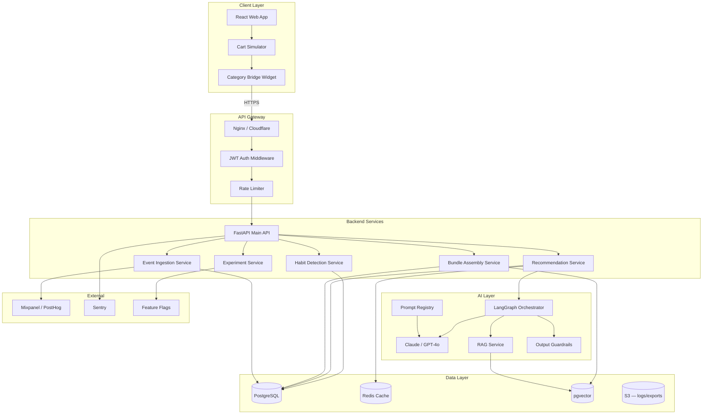
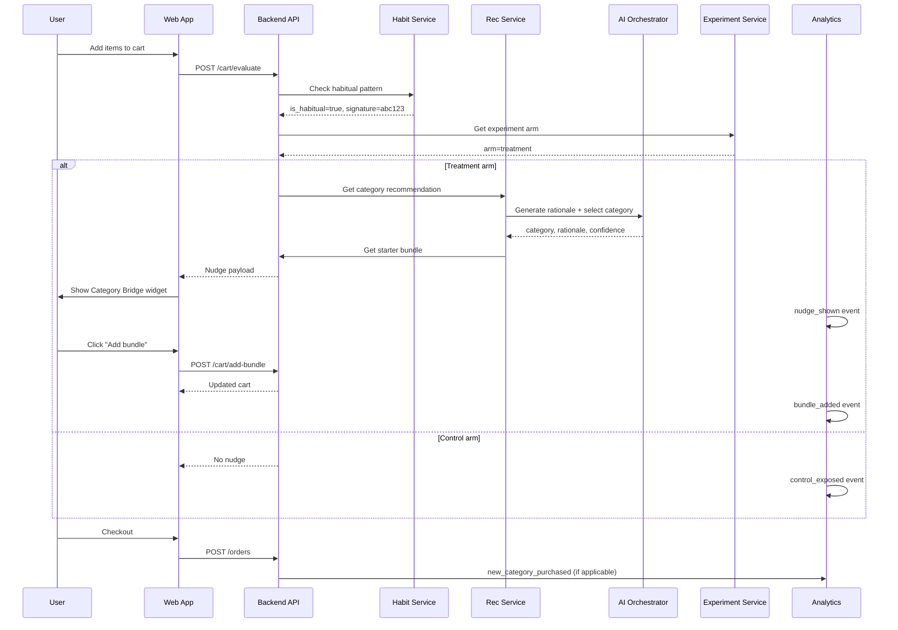
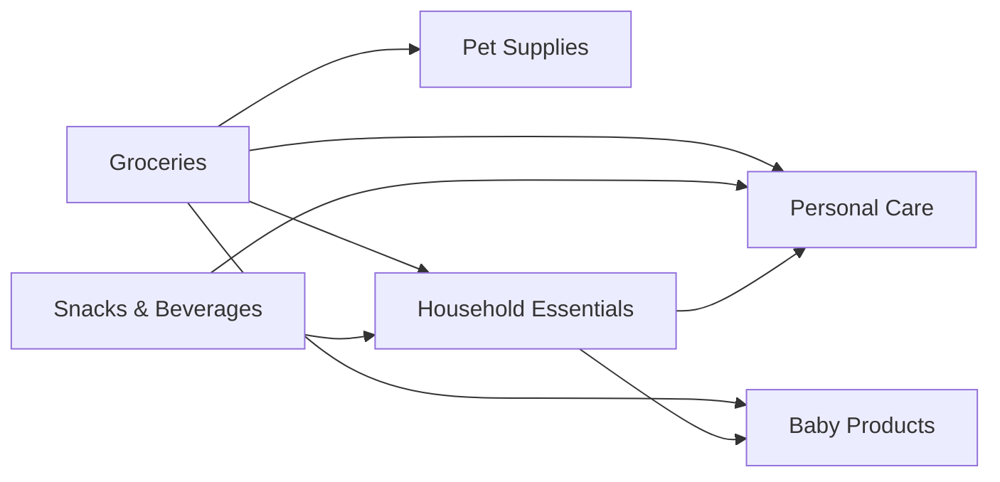
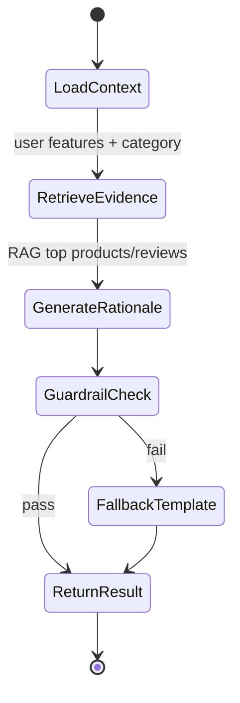
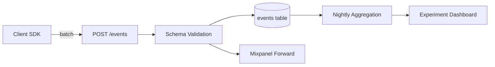
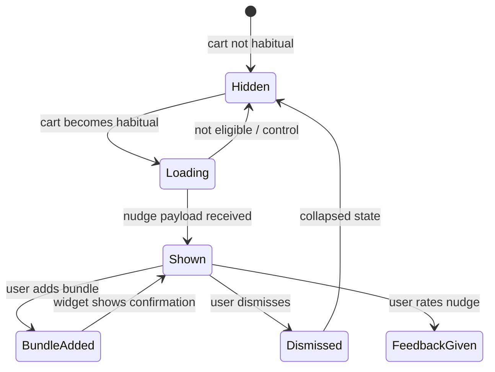
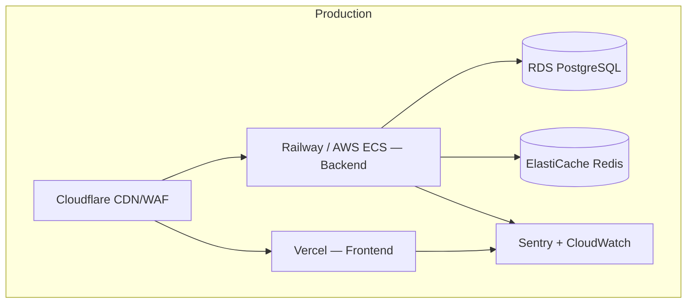
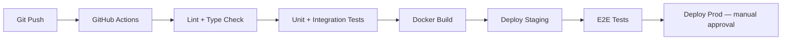
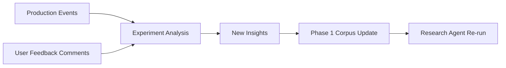

# Phase 4 — AI-Native MVP: Smart Category Bridge (Detailed Architecture)

## 1. Objective & Scope

Design, build, and **deploy to production** an AI-native MVP that nudges habitual Instamart shoppers toward purchasing from a new category, based on validated insights from Phases 1–3.

**MVP name:** Smart Category Bridge  
**Form factor:** Standalone web app prototype simulating Instamart cart experience (or feature module if Swiggy API access available)

### In Scope

- Habitual cart detection
- Category recommendation engine
- AI-generated personalized rationale
- Starter SKU bundle assembly
- In-cart widget UI
- A/B experimentation framework
- Analytics event pipeline
- Production deployment with monitoring

### Out of Scope (per Phase 3)

- Native Instamart app integration
- Push notifications
- Chat assistant
- Multi-language support
- ML model training pipeline (use rules + LLM for v1)

---

## 2. System Architecture



---

## 3. Core User Flow



---

## 4. Service Specifications

### 4.1 Habit Detection Service

**Purpose:** Determine if current cart matches user's habitual purchase pattern.

#### Detection Algorithm (Rule-Based v1)

```python
def is_habitual_cart(cart_skus: list[str], user_profile: UserProfile) -> HabitResult:
    """
    Habitual if:
    - ≥3 SKUs appear in user's top-10 frequent SKUs (last 90 days)
    - OR ≥70% of cart SKUs by count match frequent set
    - AND user has ≥3 prior orders (establishes pattern)
    """
    frequent_skus = set(user_profile.top_skus_90d[:10])
    overlap = len(set(cart_skus) & frequent_skus)
    overlap_ratio = overlap / len(cart_skus) if cart_skus else 0

    is_habitual = (
        user_profile.order_count >= 3
        and (overlap >= 3 or overlap_ratio >= 0.7)
    )
    return HabitResult(
        is_habitual=is_habitual,
        cart_signature=hash(tuple(sorted(cart_skus))),
        overlap_count=overlap,
        overlap_ratio=overlap_ratio
    )
```

#### API

```
POST /internal/habit/evaluate
Request:
{
  "user_id": "usr_abc123",
  "cart_skus": ["SKU001", "SKU002", "SKU003", "SKU004"]
}
Response:
{
  "is_habitual": true,
  "cart_signature": "sig_xyz789",
  "overlap_count": 4,
  "overlap_ratio": 1.0,
  "eligible_for_nudge": true
}
```

---

### 4.2 Recommendation Service

**Purpose:** Select one adjacent category not previously purchased by user.

#### Category Adjacency Graph



#### Recommendation Logic

```python
def recommend_category(user: UserProfile) -> CategoryRec:
    purchased = set(user.purchased_categories)
    primary = user.primary_category  # highest spend category
    candidates = ADJACENCY_GRAPH[primary] - purchased

    if not candidates:
        candidates = ALL_CATEGORIES - purchased - {primary}

    # Score candidates
    scores = []
    for cat in candidates:
        score = (
            0.4 * POPULARITY_SCORE[cat] +
            0.3 * SEGMENT_AFFINITY[user.segment][cat] +
            0.3 * (1 - user.dismissed_categories.get(cat, 0) * 0.5)
        )
        scores.append((cat, score))

    best = max(scores, key=lambda x: x[1])
    return CategoryRec(category=best[0], score=best[1])
```

#### Pre-computation & Cache

- Cache key: `rec:{user_id}:{cart_signature}`
- TTL: 24 hours
- Invalidate on: new order, category purchase, nudge dismiss

---

### 4.3 AI Orchestrator (LangGraph)

**Purpose:** Generate personalized rationale and validate recommendation quality.



#### Prompt Template (Rationale Generation)

```
System: You are a helpful Instamart shopping assistant. Write concise,
friendly copy. Never mention user PII. Max 2 sentences.

User context (anonymized features):
- Primary category: {primary_category}
- Order frequency: {order_frequency_band}  # e.g., "weekly"
- Suggested category: {suggested_category}
- Segment: {segment}

Retrieved product signals:
{rag_context}

Task: Write a personalized rationale for why this user might want to try
{suggested_category}. Reference their shopping pattern, not personal details.
Do not use superlatives or make unverifiable claims.
```

#### Guardrails

| Check | Rule | Fallback |
|-------|------|----------|
| Length | ≤280 characters | Truncate |
| PII leak | No names, addresses, phones | Block + template |
| Category mismatch | Rationale mentions correct category | Regenerate once |
| Prohibited claims | No medical/health claims | Template |
| Tone | No urgency manipulation | Soften language |

#### Fallback Template

```
"Customers who regularly buy {primary_category} often pick up
{suggested_category} essentials too. Here are top-rated starter picks."
```

---

### 4.4 Bundle Assembly Service

**Purpose:** Curate 2–3 SKUs for the recommended category.

#### Selection Criteria

| Criterion | Weight | Source |
|-----------|--------|--------|
| Rating ≥ 4.0 | Required | Product catalog |
| Price ≤ ₹150 per SKU | Preferred | Catalog |
| Variety (different sub-types) | 30% | Rule engine |
| Popularity in segment | 40% | Catalog analytics |
| RAG relevance to user | 30% | Vector search |

#### API

```
GET /internal/bundle?category=personal_care&user_id=usr_abc123
Response:
{
  "bundle_id": "bnd_001",
  "category": "personal_care",
  "skus": [
    {"sku_id": "SKU101", "name": "Dove Soap 100g", "price": 65, "rating": 4.5},
    {"sku_id": "SKU102", "name": "Colgate 100g", "price": 55, "rating": 4.3},
    {"sku_id": "SKU103", "name": "Dettol 100ml", "price": 69, "rating": 4.4}
  ],
  "total_price": 189,
  "avg_rating": 4.4
}
```

---

### 4.5 Experiment Service

**Purpose:** Assign users to control/treatment arms for A/B test.

#### Assignment Logic

```python
def get_experiment_arm(user_id: str, experiment_id: str) -> str:
    # Deterministic hash-based assignment for consistency
    hash_val = int(hashlib.md5(f"{experiment_id}:{user_id}".encode()).hexdigest(), 16)
    return "treatment" if hash_val % 100 < 50 else "control"
```

#### Experiment Config

```json
{
  "experiment_id": "exp_category_bridge_v1",
  "name": "Smart Category Bridge MVP",
  "start_date": "2026-03-01",
  "end_date": "2026-04-01",
  "traffic_pct": 100,
  "arms": {
    "control": {"weight": 50, "description": "No nudge shown"},
    "treatment": {"weight": 50, "description": "Category Bridge widget shown"}
  },
  "primary_metric": "new_category_purchase_30d",
  "guardrails": ["reorder_rate", "order_completion_rate"]
}
```

---

### 4.6 Event Ingestion Service

**Purpose:** Capture analytics events for funnel analysis and north-star measurement.

#### Event Pipeline



---

## 5. API Specification (Public)

### 5.1 Base URL

```
Production:  https://category-bridge.{domain}.com/api/v1
Staging:     https://staging-category-bridge.{domain}.com/api/v1
```

### 5.2 Endpoints

#### `POST /cart/evaluate`

Evaluate cart for nudge eligibility and return nudge payload if applicable.

**Request:**
```json
{
  "user_id": "usr_abc123",
  "cart_items": [
    {"sku_id": "SKU001", "quantity": 1},
    {"sku_id": "SKU002", "quantity": 2}
  ]
}
```

**Response (treatment, eligible):**
```json
{
  "nudge": {
    "nudge_id": "ndg_001",
    "category": "personal_care",
    "category_label": "Personal Care",
    "rationale": "You buy groceries weekly — customers like you also pick up these essentials.",
    "bundle": {
      "bundle_id": "bnd_001",
      "skus": [...],
      "total_price": 189,
      "avg_rating": 4.4
    },
    "experiment_arm": "treatment"
  },
  "is_habitual": true,
  "eligible": true
}
```

**Response (control or not eligible):**
```json
{
  "nudge": null,
  "is_habitual": true,
  "eligible": false,
  "reason": "control_arm" | "not_habitual" | "already_purchased_category" | "dismissed_this_session"
}
```

#### `POST /cart/add-bundle`

Add starter bundle SKUs to cart.

**Request:**
```json
{
  "user_id": "usr_abc123",
  "nudge_id": "ndg_001",
  "bundle_id": "bnd_001"
}
```

#### `POST /nudge/dismiss`

Record nudge dismissal.

**Request:**
```json
{
  "user_id": "usr_abc123",
  "nudge_id": "ndg_001",
  "reason": "not_relevant" | "already_buy_elsewhere" | "not_now" | null
}
```

#### `POST /nudge/feedback`

**Request:**
```json
{
  "user_id": "usr_abc123",
  "nudge_id": "ndg_001",
  "rating": "up" | "down",
  "comment": "optional string"
}
```

#### `POST /events`

Batch event ingestion.

**Request:**
```json
{
  "events": [
    {
      "event_name": "nudge_shown",
      "user_id": "usr_abc123",
      "timestamp": "2026-03-15T10:30:00Z",
      "properties": {
        "nudge_id": "ndg_001",
        "category": "personal_care",
        "experiment_arm": "treatment"
      }
    }
  ]
}
```

#### `POST /orders`

Simulate order completion; triggers new-category detection.

**Request:**
```json
{
  "user_id": "usr_abc123",
  "order_id": "ord_001",
  "skus": ["SKU001", "SKU101", "SKU102"],
  "categories": ["groceries", "personal_care"]
}
```

---

## 6. Frontend Architecture

### 6.1 Component Tree

```
App
├── AuthProvider
├── ExperimentProvider
├── CartPage
│   ├── CartItemList
│   ├── CategoryBridgeWidget
│   │   ├── NudgeHeader
│   │   ├── RationaleText
│   │   ├── BundleCard
│   │   │   └── SKUChip (×3)
│   │   ├── AddBundleButton
│   │   ├── DismissButton
│   │   └── FeedbackRow
│   └── CheckoutButton
├── OrderHistoryPage
└── AdminDashboard (internal)
    ├── ExperimentResults
    └── EventFunnel
```

### 6.2 Widget State Machine



### 6.3 Tech Stack

| Layer | Technology |
|-------|------------|
| Framework | React 18 + TypeScript |
| Styling | Tailwind CSS |
| State | Zustand or React Context |
| HTTP | TanStack Query (React Query) |
| Analytics SDK | Custom wrapper → POST /events |
| Build | Vite |
| Deploy | Vercel or Netlify (frontend) |

---

## 7. Data Model (Phase 4)

### 7.1 Core Tables

```sql
-- Simulated user profiles (or synced from Swiggy if API available)
CREATE TABLE users (
    id              VARCHAR(50) PRIMARY KEY,
    segment         VARCHAR(100),
    primary_category VARCHAR(100),
    order_count     INTEGER DEFAULT 0,
    created_at      TIMESTAMPTZ DEFAULT NOW()
);

CREATE TABLE user_category_history (
    user_id         VARCHAR(50) REFERENCES users(id),
    category        VARCHAR(100),
    first_purchased_at TIMESTAMPTZ,
    purchase_count  INTEGER DEFAULT 1,
    PRIMARY KEY (user_id, category)
);

CREATE TABLE user_frequent_skus (
    user_id         VARCHAR(50) REFERENCES users(id),
    sku_id          VARCHAR(50),
    purchase_count  INTEGER,
    last_purchased  TIMESTAMPTZ,
    PRIMARY KEY (user_id, sku_id)
);

CREATE TABLE products (
    sku_id          VARCHAR(50) PRIMARY KEY,
    name            VARCHAR(255),
    category        VARCHAR(100),
    price           DECIMAL(10,2),
    rating          DECIMAL(3,2),
    image_url       TEXT
);

CREATE TABLE nudges (
    nudge_id        VARCHAR(50) PRIMARY KEY,
    user_id         VARCHAR(50) REFERENCES users(id),
    cart_signature  VARCHAR(64),
    category        VARCHAR(100),
    rationale       TEXT,
    bundle_id       VARCHAR(50),
    experiment_arm  VARCHAR(20),
    shown_at        TIMESTAMPTZ,
    dismissed_at    TIMESTAMPTZ,
    dismiss_reason  VARCHAR(50),
    bundle_added    BOOLEAN DEFAULT FALSE,
    feedback_rating VARCHAR(10)
);

CREATE TABLE experiment_assignments (
    user_id         VARCHAR(50),
    experiment_id   VARCHAR(50),
    arm             VARCHAR(20),
    assigned_at     TIMESTAMPTZ DEFAULT NOW(),
    PRIMARY KEY (user_id, experiment_id)
);

CREATE TABLE events (
    id              BIGSERIAL PRIMARY KEY,
    event_name      VARCHAR(100) NOT NULL,
    user_id         VARCHAR(50),
    timestamp       TIMESTAMPTZ NOT NULL,
    properties      JSONB,
    ingested_at     TIMESTAMPTZ DEFAULT NOW()
);

CREATE INDEX idx_events_name_ts ON events(event_name, timestamp);
CREATE INDEX idx_events_user ON events(user_id, timestamp);
```

---

## 8. Infrastructure & Deployment

### 8.1 Environment Topology



### 8.2 Environment Config

| Env | Purpose | URL Pattern | Data |
|-----|---------|-------------|------|
| **dev** | Local development | localhost:5173 / :8000 | Seed data |
| **staging** | Pre-prod testing | staging.* | Anonymized prod-like |
| **prod** | Live MVP | app.* | Real/simulated users |

### 8.3 CI/CD Pipeline



### 8.4 Docker Compose (Local Dev)

```yaml
services:
  api:
    build: ./phase4-mvp/backend
    ports: ["8000:8000"]
    environment:
      DATABASE_URL: postgresql://user:pass@db:5432/category_bridge
      REDIS_URL: redis://redis:6379
      OPENAI_API_KEY: ${OPENAI_API_KEY}
    depends_on: [db, redis]

  frontend:
    build: ./phase4-mvp/frontend
    ports: ["5173:5173"]
    environment:
      VITE_API_URL: http://localhost:8000/api/v1

  db:
    image: pgvector/pgvector:pg15
    volumes: ["pgdata:/var/lib/postgresql/data"]

  redis:
    image: redis:7-alpine
```

---

## 9. Security Architecture

| Layer | Control |
|-------|---------|
| **Transport** | TLS 1.3 everywhere |
| **Auth** | JWT tokens, 24h expiry, refresh rotation |
| **API** | Rate limit 100 req/min per user |
| **LLM prompts** | Feature-only context; no names/emails/addresses |
| **Secrets** | AWS Secrets Manager / Railway env vars |
| **CORS** | Whitelist frontend origin only |
| **Input validation** | Pydantic models on all endpoints |
| **Logging** | No PII in logs; request IDs for tracing |

---

## 10. Observability

### 10.1 Monitoring Stack

| Tool | Purpose |
|------|---------|
| **Sentry** | Error tracking, performance traces |
| **CloudWatch / Railway metrics** | CPU, memory, request count |
| **Custom dashboard** | Experiment funnel, north-star daily |
| **PagerDuty / Slack alerts** | Error rate > 1%, p95 latency > 2s |

### 10.2 Key Dashboards

**Operational Dashboard**
- API request rate, error rate, p50/p95 latency
- LLM call count, cost, fallback rate
- Cache hit rate

**Experiment Dashboard**
- Users by arm (control vs treatment)
- Funnel: eligible → shown → clicked → bundle added → new category purchased
- North-star metric by arm with confidence interval
- Guardrail metrics vs control

---

## 11. Experiment Design (Detailed)

### 11.1 Sample Size Estimate

```
Baseline new-category rate (assumed): 8%
Minimum detectable effect: 15% relative (→ 9.2% absolute)
α = 0.05, power = 0.80
Required per arm: ~6,200 users
Duration at 500 eligible users/day: ~25 days
```

For MVP demo with simulated users, report directional lift with caveat on sample size.

### 11.2 Analysis Plan

| Metric | Type | Analysis |
|--------|------|----------|
| `new_category_purchase_30d` | Primary | Chi-square / z-test on proportions |
| `nudge_ctr` | Secondary | Proportion test |
| `bundle_add_rate` | Secondary | Proportion test |
| `reorder_rate` | Guardrail | Non-inferiority vs control (-2% margin) |
| `order_completion` | Guardrail | Non-inferiority |

### 11.3 Rollback Triggers

| Condition | Action |
|-----------|--------|
| Reorder rate drops >3% vs control | Pause experiment |
| Error rate >5% on nudge endpoint | Rollback to static template |
| LLM guardrail failure >10% | Switch to template-only rationale |
| Dismiss rate >60% | Pause + iterate copy/UX |

---

## 12. Feedback Loop to Phase 1

Production events and qualitative feedback feed back into the discovery engine:



**Examples of learnings to ingest:**
- "Not relevant" dismiss reasons → new barrier tags
- High CTR categories → segment affinity updates
- Negative feedback on rationale → copy/guardrail iteration
- New category purchase patterns → validate/invalidate hypotheses

---

## 13. Implementation Sprint Plan

| Sprint | Duration | Deliverables |
|--------|----------|--------------|
| **Sprint 1** | Week 1 | DB schema, seed data, habit detection, basic cart UI |
| **Sprint 2** | Week 2 | Rec engine, bundle assembly, widget UI |
| **Sprint 3** | Week 3 | AI orchestrator, guardrails, experiment service |
| **Sprint 4** | Week 4 | Event pipeline, analytics dashboard, staging deploy |
| **Sprint 5** | Week 5 | Prod deploy, experiment launch, monitoring |

---

## 14. Deliverables Checklist

- [ ] Production URL (frontend + API)
- [ ] GitHub repository with README and setup instructions
- [ ] API documentation (OpenAPI/Swagger)
- [ ] Event tracking spec implemented
- [ ] A/B experiment live or launch-ready
- [ ] Experiment dashboard showing funnel
- [ ] Architecture diagram (updated with actual stack)
- [ ] Demo script / video walkthrough
- [ ] Initial results report or launch readiness doc

---

## 15. Success Criteria & Exit Gate

| Criterion | Threshold |
|-----------|-----------|
| Production deployed | Public URL accessible |
| Core flow works | Habit detect → nudge → bundle add → checkout |
| AI rationale | ≥90% pass guardrails; <500ms generation p95 |
| Experiment | Control/treatment assignment working |
| Analytics | All P0 events firing correctly |
| Guardrails monitored | Dashboard live |
| No P0 bugs | 48h soak test pass |

**Exit gate:** MVP live in production + experiment running (or launch-ready with sign-off) + initial funnel data collected.

---

## 16. Project Structure (Implementation)

```
phase4-mvp/
├── frontend/
│   ├── src/
│   │   ├── components/
│   │   │   └── CategoryBridgeWidget/
│   │   ├── pages/
│   │   ├── hooks/
│   │   ├── services/api.ts
│   │   └── analytics/
│   ├── package.json
│   └── vite.config.ts
├── backend/
│   ├── app/
│   │   ├── main.py
│   │   ├── routers/
│   │   │   ├── cart.py
│   │   │   ├── nudge.py
│   │   │   └── events.py
│   │   ├── services/
│   │   │   ├── habit.py
│   │   │   ├── recommendation.py
│   │   │   ├── bundle.py
│   │   │   └── experiment.py
│   │   ├── ai/
│   │   │   ├── orchestrator.py
│   │   │   ├── prompts/
│   │   │   └── guardrails.py
│   │   └── models/
│   ├── tests/
│   ├── Dockerfile
│   └── requirements.txt
├── infra/
│   ├── docker-compose.yml
│   ├── github-actions/
│   └── terraform/          # optional
├── seed/
│   ├── products.csv
│   └── demo_users.json
└── README.md
```
