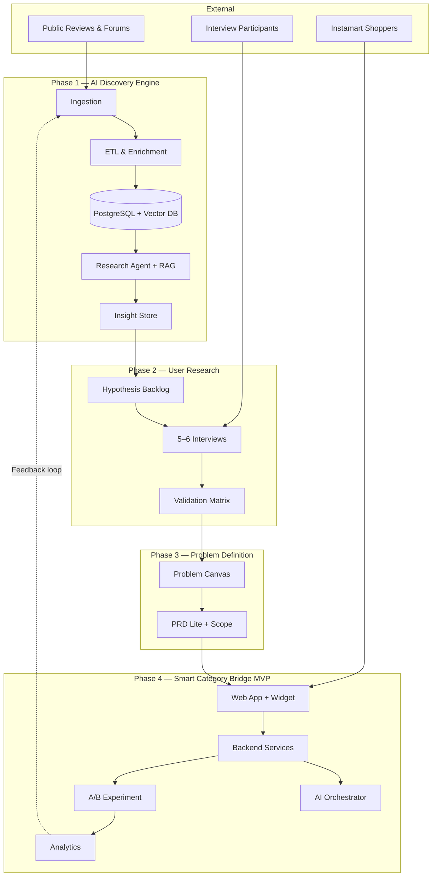
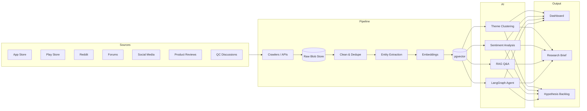
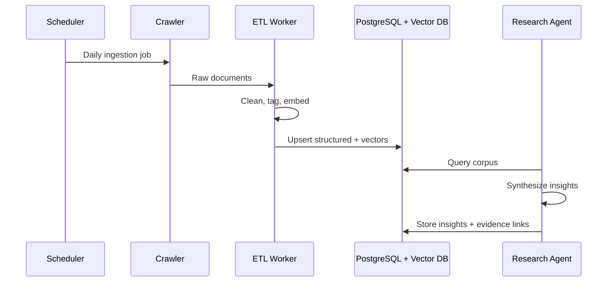
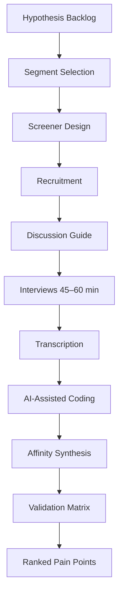
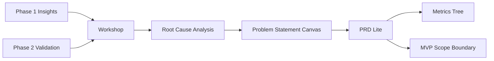
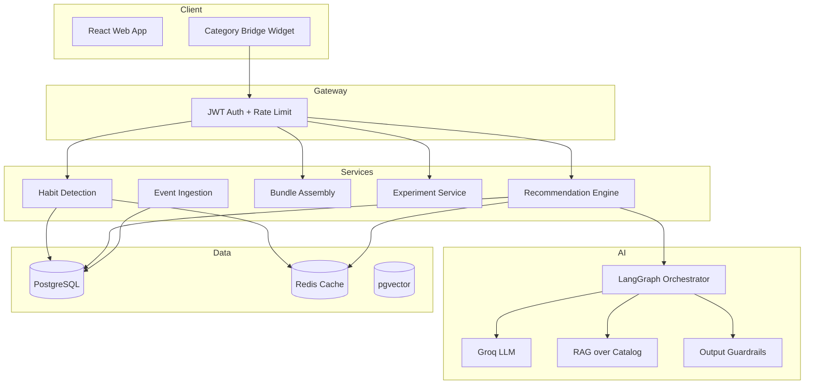
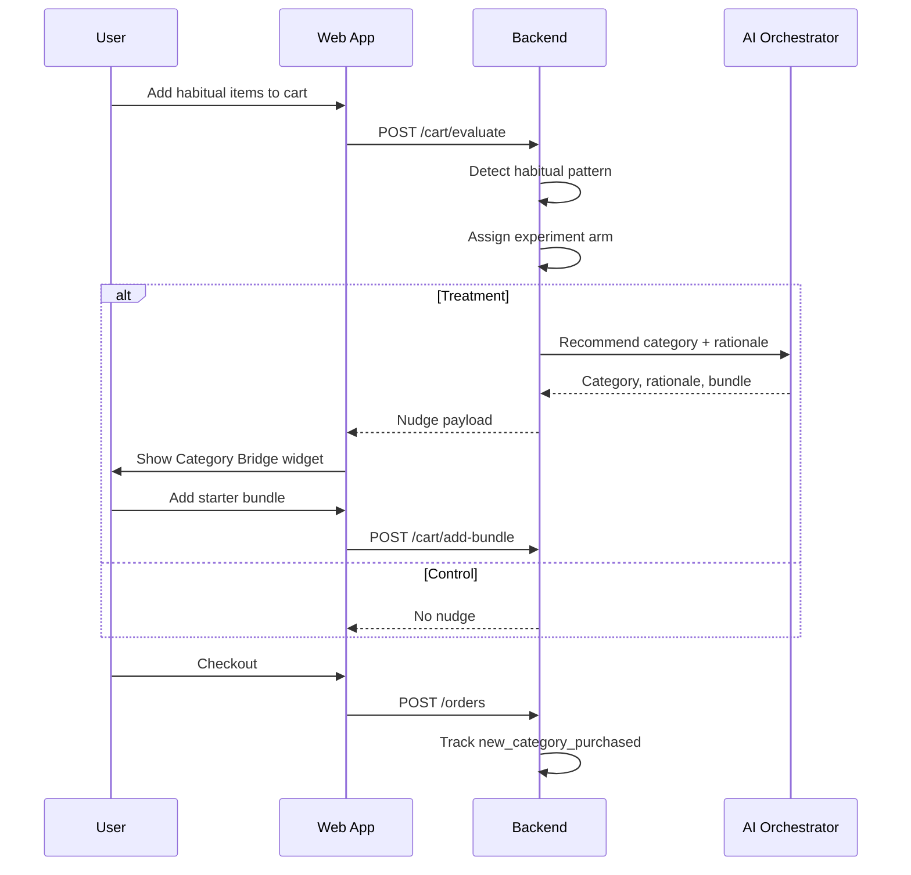
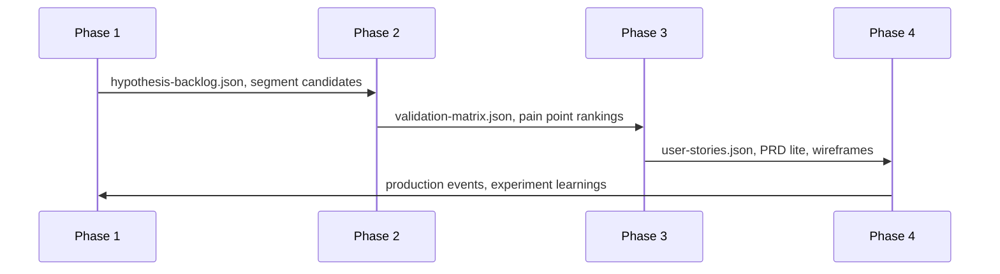
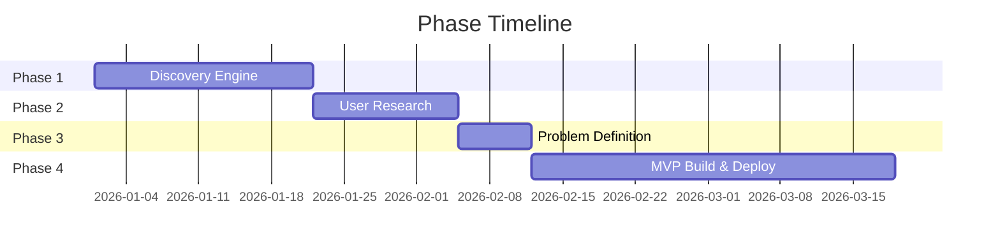

# Phase-Wise Architecture — Swiggy Instamart New Category Discovery

## 1. Context & Strategic Goal

Swiggy Instamart users frequently reorder from the same categories (groceries, snacks, household essentials) and rarely explore adjacent categories (personal care, pet supplies, baby products). The strategic goal is to **increase the percentage of Monthly Active Customers (MAC) who purchase from at least one new category every month**.

This document defines a four-phase, AI-native architecture aligned with the problem statement:

| Problem Statement Part | Architecture Phase |
|------------------------|-------------------|
| Part 1 — AI-Powered Discovery Engine | Phase 1 |
| Part 2 — User Research Validation | Phase 2 |
| Part 3 — Define the Problem | Phase 3 |
| Part 4 — AI-Native MVP (Production) | Phase 4 |

**Detailed specifications:** [`doc/architecture/`](architecture/00-overview.md)

---

## 2. North-Star Metrics

```
North-Star
└── % MAC with ≥1 new category purchase in rolling 30 days
    ├── Input metrics
    │   ├── Nudge impression rate
    │   ├── Nudge CTR
    │   ├── Starter bundle add-to-cart rate
    │   └── New category checkout conversion
    ├── Quality metrics
    │   ├── Time to first new category
    │   ├── Repeat new-category rate (60 days)
    │   └── Category exploration depth
    └── Guardrail metrics
        ├── Core reorder rate (≤2% drop vs control)
        ├── Order completion rate
        └── Widget dismiss rate
```

---

## 3. End-to-End Architecture



---

## 4. Phase Overview

| Phase | Duration | Core System | Primary Output | Exit Gate |
|-------|----------|-------------|----------------|-----------|
| **1** | 2–3 weeks | AI Discovery Engine | Research brief + hypothesis backlog | ≥500 docs, ≥10 hypotheses, validated insights |
| **2** | 2 weeks | Interview & synthesis pipeline | Validation matrix + pain points | 5–6 interviews, hypotheses classified |
| **3** | 1 week | Problem framing workshop | Problem statement + PRD lite | Stakeholder go for MVP |
| **4** | 3–5 weeks | Smart Category Bridge | Production MVP + experiment | Deployed URL, A/B live |

---

# Phase 1 — AI-Powered Discovery Engine

## Objective

Build an AI-native system that analyzes public user feedback at scale **before proposing any product solution**. The engine must demonstrate how data is gathered, themes identified, insights generated, and quality validated.

## Architecture



## Components

| Layer | Technology | Responsibility |
|-------|------------|----------------|
| Orchestration | n8n / Temporal | Scheduled ingestion, retries |
| Ingestion | Apify, PRAW, custom scrapers | App Store, Play Store, Reddit, forums |
| Storage | S3 (raw), PostgreSQL, pgvector | Raw, structured, semantic layers |
| Processing | Python ETL | Clean, dedupe, PII redact, NER, embed |
| AI Analysis | Groq LLM + LangGraph | Clustering, RAG, hypothesis generation (API key in .env) |
| Validation | Human review UI | Quote traceability, inter-rater agreement |

## Deployment

**Live demo:** https://swiggy-instamart-order-discovery-en.vercel.app/

Phase 1 deploys as a **Next.js app on Vercel**.

| Layer | Entry point | Notes |
|-------|-------------|-------|
| **Production UI** | `frontend/` on Vercel | https://swiggy-instamart-order-discovery-en.vercel.app/ |
| Data | `data/processed/`, `outputs/handoff/` | JSON read at API runtime |

**Local:** `cd frontend && npm run dev` → http://localhost:3000  
**Production:** Vercel — import repo, root directory `phase1-discovery/frontend`  

Detailed deployment spec: [`architecture/phase1-ai-discovery-engine.md` §16](architecture/phase1-ai-discovery-engine.md)  
Frontend deploy guide: [`phase1-discovery/frontend/README.md`](../phase1-discovery/frontend/README.md)  
Presentation summary: [`phase1-discovery-engine-summary.md`](phase1-discovery-engine-summary.md)

## Research Questions → Modules

| Question | Module |
|----------|--------|
| Why repeat same categories? | Habit Pattern Analyzer + theme clustering |
| What prevents exploration? | Barrier Taxonomy Classifier (B1–B7) |
| How do users discover today? | Discovery Path Extractor |
| Role of habits? | Temporal Language Analyzer |
| Info needed before new category? | Information-Gap Tagger |
| Recurring frustrations? | Frustration Spike Detector |
| Segments that experiment? | Segment Tagger |
| Unmet needs? | Need-State Clusterer + RAG synthesis |

## Barrier Taxonomy

| Code | Barrier |
|------|---------|
| B1 | Habit / reorder lock-in |
| B2 | Trust / quality uncertainty |
| B3 | Discovery friction |
| B4 | Price sensitivity |
| B5 | Cognitive overload |
| B6 | Delivery / freshness concern |
| B7 | Need for social proof |

## Data Flow



## Deliverables

1. Automated data pipeline (≥3 source types, ≥500 documents)
2. Insight corpus with quote-linked findings
3. Research brief (themes, barriers, segments, opportunities)
4. Validation report (methodology, inter-rater agreement, limitations)
5. `hypothesis-backlog.json` for Phase 2

## Success Criteria

- Each insight traceable to ≥3 source quotes
- All 8 research questions (Q1–Q8) addressed
- Human reviewer agreement κ ≥ 0.8 on top-10 themes
- ≥10 testable hypotheses exported

→ [Full Phase 1 spec](architecture/phase1-ai-discovery-engine.md)

---

# Phase 2 — Validate Through User Research

## Objective

Validate, refine, or reject Phase 1 AI insights through **5–6 semi-structured interviews** with a focused target segment. AI insights are a starting point only — primary research is required.

## Architecture



## Target Segment (Recommended)

**Habitual Grocery Repeaters**

- 2+ Instamart orders/month for 3+ months
- ≥80% spend in groceries/snacks
- Zero purchases in personal care, pet, or baby categories
- Urban, 25–40, tier-1 metro

## Interview Pipeline

| Step | Tool | Output |
|------|------|--------|
| Screener | Typeform | Qualified participants |
| Scheduling | Calendly | 5–6 confirmed sessions |
| Recording | Zoom / Meet | Audio/video |
| Transcription | Whisper / Otter | De-identified transcripts |
| Coding | Groq LLM + human review | Tagged quote segments |
| Synthesis | Miro / FigJam | Affinity clusters |

## Discussion Guide Structure (60 min)

| Block | Duration | Focus |
|-------|----------|-------|
| Warm-up & consent | 5 min | Rapport, recording permission |
| Instamart usage | 10 min | Frequency, categories, role |
| Last orders deep-dive | 15 min | Habit evidence, reorder behavior |
| Category exploration | 15 min | Barriers, past attempts |
| Workarounds | 10 min | Amazon, local stores, other apps |
| Ideal discovery | 10 min | Concept reaction (lo-fi mock) |
| Wrap-up | 5 min | Open floor |

## Validation Matrix

Each Phase 1 hypothesis receives a status:

| Status | Definition |
|--------|------------|
| **Confirmed** | ≥4/6 interviews support; aligns with AI |
| **Partially confirmed** | 2–3/6 support; nuance added |
| **Challenged** | ≤1/6 support or direct contradiction |
| **New** | Not in Phase 1; emerged ≥3 times in interviews |

## Deliverables

1. Segment definition + screener
2. Discussion guide
3. 5–6 anonymized transcripts
4. Validation matrix (`validation-matrix.json`)
5. Top 5 ranked pain points with quotes
6. Synthesis report (3–5 pages)

## Success Criteria

- 5–6 completed interviews with qualified segment
- 100% of top-10 hypotheses classified
- ≥3 confirmed pain points with ≥4/6 evidence

→ [Full Phase 2 spec](architecture/phase2-user-research-validation.md)

---

# Phase 3 — Define the Problem

## Objective

Frame the problem by articulating target segment, root cause, workarounds, user value, and business value — demonstrating how primary research validated or challenged AI insights.

## Architecture



## Problem Statement Canvas (Required Fields)

| Field | Source |
|-------|--------|
| **Target user segment** | Phase 2 screener + Phase 1 segment signals |
| **Root cause** | Validated barriers from interviews (5 Whys) |
| **Existing workarounds** | Interview evidence (Amazon, local stores, skip) |
| **User value** | Reduced friction, confidence, time saved |
| **Business value** | MAC new-category %, AOV, retention, penetration |
| **AI vs. research delta** | Confirmed / Challenged / New table |

## Example Problem Frame

> **Segment:** Weekly Instamart grocery buyers (2+ orders/month) with zero adjacent category purchases.  
> **Root cause:** Reorder-optimized flow creates habit loop; trust gap for unfamiliar non-grocery categories.  
> **Workaround:** Personal care and pet supplies purchased on Amazon despite Instamart for staples.  
> **User value:** Discover relevant categories without breaking fast reorder flow.  
> **Business value:** Unlock adjacent category GMV from highest-frequency users.

## Solution Opportunity Scoring

| Direction | Impact | Confidence | Effort | Selected |
|-----------|--------|------------|--------|----------|
| **Category Bridge widget** | 5 | 4 | 3 | Yes |
| Full catalog redesign | 4 | 2 | 5 | No |
| Push notifications | 3 | 2 | 2 | No |
| Chat assistant | 4 | 3 | 4 | Deferred |

**MVP direction:** Smart Category Bridge — in-cart widget suggesting one adjacent category with AI rationale and starter bundle.

## PRD Lite — Core User Stories

| ID | Story | Priority |
|----|-------|----------|
| US-001 | Contextual category nudge after habitual cart detected | P0 |
| US-002 | Starter bundle (2–3 SKUs) with one-tap add | P0 |
| US-003 | Thumbs up/down feedback on suggestion | P0 |

## MVP Scope

**In scope:** Habit detection, one category nudge, AI rationale, starter bundle, A/B test, web prototype, production deploy

**Out of scope:** Native app integration, push notifications, chat assistant, multi-language, ML model training

## Deliverables

1. One-page problem statement
2. AI vs. research delta document
3. PRD lite with acceptance criteria
4. Metrics tree + experiment hypothesis
5. Lo-fi wireframes (nudge shown, dismissed, bundle added)
6. `user-stories.json` for Phase 4

## Success Criteria

- All 5 problem canvas fields complete
- MVP scope approved by stakeholders
- Falsifiable experiment hypothesis defined

→ [Full Phase 3 spec](architecture/phase3-problem-definition.md)

---

# Phase 4 — AI-Native MVP: Smart Category Bridge

## Objective

Design, build, and **deploy to production** a functional MVP that nudges habitual shoppers toward new category exploration.

## System Architecture



## Core User Flow



## Backend Services

| Service | Responsibility |
|---------|----------------|
| **Habit Detection** | Cart matches ≥3 frequent SKUs or ≥70% overlap with top-10 |
| **Recommendation** | Select one adjacent unpurchased category via adjacency graph |
| **Bundle Assembly** | Curate 2–3 SKUs (rating ≥4.0, price ≤₹150, variety) |
| **AI Orchestrator** | Generate personalized rationale with guardrails + fallback template |
| **Experiment** | Deterministic 50/50 hash-based control/treatment assignment |
| **Event Ingestion** | Capture funnel events for north-star measurement |

## API Endpoints

| Method | Path | Purpose |
|--------|------|---------|
| POST | `/cart/evaluate` | Check eligibility, return nudge payload |
| POST | `/cart/add-bundle` | Add starter bundle to cart |
| POST | `/nudge/dismiss` | Record dismissal with reason |
| POST | `/nudge/feedback` | Thumbs up/down |
| POST | `/orders` | Complete order, detect new category |
| POST | `/events` | Batch analytics events |

## Widget States

```
┌─────────────────────────────────────┐
│  ✨ Try something new               │
│  Personal Care                      │
│  "You buy groceries weekly —        │
│   customers like you also pick up   │
│   these essentials."                │
│  [Dove] [Colgate] [Dettol]          │
│  Bundle: ₹189  ★4.3                 │
│  [Add bundle]  [Not now ✕]          │
└─────────────────────────────────────┘
```

## Tech Stack

| Layer | Technology |
|-------|------------|
| Frontend | React 18 + TypeScript + Tailwind + Vite |
| Backend | Python FastAPI |
| Database | PostgreSQL 15 + pgvector |
| Cache | Redis |
| AI | Groq LLM via LangGraph |
| Deploy | Vercel (FE) + Railway/AWS (BE) |
| Analytics | Mixpanel / PostHog |
| Monitoring | Sentry |

## Experiment Design

| Arm | Experience |
|-----|------------|
| Control (50%) | Standard cart, no nudge |
| Treatment (50%) | Category Bridge widget after habitual cart |

**Primary metric:** % users with ≥1 new category purchase in 30 days  
**Guardrails:** Reorder rate, order completion, dismiss rate

## Production Checklist

- [ ] Dev / staging / prod environments
- [ ] JWT auth + rate limiting
- [ ] LLM prompt versioning + fallback templates
- [ ] PII-free AI prompts (feature-only context)
- [ ] Sentry error monitoring
- [ ] Event schema for all P0 metrics
- [ ] Rollback plan for recommendation failures

## Deliverables

1. Production URL (frontend + API)
2. OpenAPI documentation
3. Event tracking spec (implemented)
4. A/B experiment live
5. Experiment funnel dashboard
6. Demo walkthrough

## Success Criteria

- End-to-end flow: habit detect → nudge → bundle add → checkout
- AI rationale passes guardrails ≥90% of time
- All P0 analytics events firing
- Experiment running with control/treatment split

→ [Full Phase 4 spec](architecture/phase4-ai-native-mvp.md)

---

## 5. Cross-Phase Handoffs



| Handoff | Key Artifacts |
|---------|---------------|
| Phase 1 → 2 | `hypothesis-backlog.json`, research brief, top quotes |
| Phase 2 → 3 | `validation-matrix.json`, synthesis report, quote library |
| Phase 3 → 4 | `user-stories.json`, PRD lite, metrics tree, wireframes |
| Phase 4 → 1 | Event data, dismiss reasons, experiment results |

→ [Schemas & contracts](architecture/appendix-schemas-and-contracts.md)

---

## 6. Timeline



| Phase | Duration | Cumulative |
|-------|----------|------------|
| Phase 1 | 2–3 weeks | Week 3 |
| Phase 2 | 2 weeks | Week 5 |
| Phase 3 | 1 week | Week 6 |
| Phase 4 | 3–5 weeks | Week 9–11 |

---

## 7. Repository Structure

```
SwiggyInstamart_Order_NewCategory/
├── doc/
│   ├── problemStatement.md
│   ├── phaseWiseArchitecture.md       ← this document
│   └── architecture/                  ← detailed phase specs
│       ├── 00-overview.md
│       ├── phase1-ai-discovery-engine.md
│       ├── phase2-user-research-validation.md
│       ├── phase3-problem-definition.md
│       ├── phase4-ai-native-mvp.md
│       └── appendix-schemas-and-contracts.md
├── phase1-discovery/
│   ├── ingestion/
│   ├── processing/
│   ├── analysis/
│   └── outputs/
├── phase2-research/
│   ├── screener/
│   ├── guides/
│   ├── transcripts/
│   └── synthesis/
├── phase3-definition/
│   └── outputs/
└── phase4-mvp/
    ├── frontend/
    ├── backend/
    └── infra/
```

---

## 8. Design Principles

1. **AI-native by default** — LLMs and agents for analysis, synthesis, and personalization
2. **Evidence-linked insights** — Every claim traces to source quotes or interview excerpts
3. **Validate before build** — MVP scope constrained by Phase 2, not Phase 1 alone
4. **Production-grade MVP** — Auth, monitoring, experimentation, rollback
5. **Closed-loop learning** — Phase 4 data feeds back into Phase 1 corpus

---

## 9. Risk Register

| ID | Risk | Mitigation | Phase |
|----|------|------------|-------|
| R1 | AI insights generic or hallucinated | Quote-linking, human review, interviews | 1, 2 |
| R2 | Wrong segment selected | Scoring model + screener validation | 2 |
| R3 | MVP disrupts reorder habit | Guardrail metrics, easy dismiss | 4 |
| R4 | LLM latency in production | Pre-compute + Redis cache | 4 |
| R5 | Shallow interview data | 45–60 min guide, barrier probes | 2 |

---

## 10. Document Index

| Document | Description |
|----------|-------------|
| [00-overview.md](architecture/00-overview.md) | Master index, principles, repo structure |
| [phase1-ai-discovery-engine.md](architecture/phase1-ai-discovery-engine.md) | Ingestion, ETL, RAG, agent, validation |
| [phase2-user-research-validation.md](architecture/phase2-user-research-validation.md) | Screener, interviews, coding, validation matrix |
| [phase3-problem-definition.md](architecture/phase3-problem-definition.md) | Problem canvas, PRD lite, metrics, scope |
| [phase4-ai-native-mvp.md](architecture/phase4-ai-native-mvp.md) | Services, APIs, AI, deployment, experiment |
| [appendix-schemas-and-contracts.md](architecture/appendix-schemas-and-contracts.md) | JSON schemas, events, prompts, taxonomies |

---

## Summary

| Phase | Focus | Primary Output |
|-------|-------|----------------|
| **1** | AI discovery at scale | Insight corpus + research brief |
| **2** | Primary research | 5–6 interviews + validation matrix |
| **3** | Problem framing | Problem statement + PRD lite |
| **4** | AI-native MVP | Smart Category Bridge in production |

Each phase has defined architecture, components, deliverables, success criteria, and handoff artifacts. Detailed implementation specs live in [`doc/architecture/`](architecture/00-overview.md).
