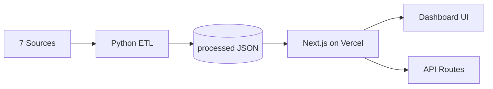

# Phase 1 Discovery — Next.js Frontend

Next.js dashboard for the Phase 1 AI Discovery Engine.

## Live demo

**https://swiggy-instamart-order-discovery-en.vercel.app/**

Deployed on **Vercel** (free public link). No Streamlit required for the full UI.

---

## Problem statement mapping

| Problem statement requirement | How this app addresses it |
|------------------------------|---------------------------|
| Analyze App Store, Play Store, Reddit, forums, social, product reviews, QC discussions | **7 source types** in corpus (3,194 docs); filter by source in left panel |
| Answer Q1–Q8 research questions | **Live Workflow** tab — dropdown per question + AI synthesis with evidence |
| Show how data is gathered & analyzed | Workflow strip: Ingest → Process → Analyze → Discovery Q1–Q8 |
| Theme identification | Top themes per question with document counts |
| Insight generation | AI synthesis + insight line + sample quotes per Q1–Q8 |
| Validate insight quality | Confidence badges, evidence counts, source-filtered quotes |
| RAG / ask the corpus | **Research Chat (RAG)** tab — keyword search by data source |
| Deploy to production | **Vercel** — public URL above |

### Research questions (Q1–Q8)

| ID | Question |
|----|----------|
| Q1 | Why do users repeatedly buy from the same categories? |
| Q2 | What prevents users from exploring new categories? |
| Q3 | How do users discover products today? |
| Q4 | What role do habits play in shopping behavior? |
| Q5 | What information do users need before trying a new category? |
| Q6 | What frustrations emerge repeatedly? |
| Q7 | Which user segments are more likely to experiment? |
| Q8 | What unmet needs emerge consistently across discussions? |

---

## Architecture (short)

```
┌─────────────────────────────────────────────────────────────────┐
│  7 Data Sources (Play Store, App Store, Reddit, Forums,         │
│  Social, Product Reviews, QC Discussions)                        │
└────────────────────────────┬────────────────────────────────────┘
                             ▼
┌─────────────────────────────────────────────────────────────────┐
│  Python pipeline: derive_sources → run_pipeline → run_analysis │
│  Output: data/processed/ + outputs/handoff/                      │
└────────────────────────────┬────────────────────────────────────┘
                             ▼
┌─────────────────────────────────────────────────────────────────┐
│  Vercel — Next.js App                                            │
│  ┌──────────────┬──────────────────────────────────────────────┐ │
│  │ Left 35%     │ Right 65%                                     │ │
│  │ Corpus stats │ Live Workflow | Research Chat (RAG)          │ │
│  │ Source list  │ Q1–Q8 answers, themes, quotes, RAG search    │ │
│  │ Dropdowns    │                                               │ │
│  └──────────────┴──────────────────────────────────────────────┘ │
│  API: /api/stats · /api/research-questions · /api/rag            │
└─────────────────────────────────────────────────────────────────┘
```



---

## Quick start steps

### 1. Clone & install

```bash
git clone https://github.com/saurabhbhatia05/swiggy-instamart-order-discovery-engine.git
cd swiggy-instamart-order-discovery-engine/phase1-discovery/frontend
npm install
```

### 2. Run locally

```bash
npm run dev
```

Open **http://localhost:3000**

> Corpus JSON must exist at `../data/processed/` and `../outputs/handoff/` (included in repo).

### 3. Build for production

```bash
npm run build
npm start
```

### 4. Regenerate corpus (optional)

From `phase1-discovery/`:

```bash
python derive_sources.py
python run_pipeline.py
python run_analysis.py
```

Then redeploy to Vercel so API routes serve updated JSON.

---

## Deploy on Vercel (Community / free tier)

Vercel Hobby (free) provides a **public HTTPS URL** — no credit card required for personal projects.

### Steps

1. **Push code to GitHub**  
   Repo: `saurabhbhatia05/swiggy-instamart-order-discovery-engine`

2. **Import on Vercel**  
   - Go to [vercel.com/new](https://vercel.com/new)  
   - Import the GitHub repository  
   - Set **Root Directory** to: `phase1-discovery/frontend`  
   - Framework Preset: **Next.js** (auto-detected)

3. **Build settings** (defaults usually work)

   | Setting | Value |
   |---------|--------|
   | Build Command | `npm run build` |
   | Output Directory | `.next` |
   | Install Command | `npm install` |

4. **Deploy**  
   Click **Deploy**. Vercel assigns a URL like:  
   `https://swiggy-instamart-order-discovery-en.vercel.app`

5. **Verify**
   - Homepage loads corpus stats in left panel  
   - **Live Workflow** — change source + question dropdowns  
   - **Research Chat (RAG)** — submit a test query  

### Important notes

- **Data paths:** APIs read `../data/processed/` and `../outputs/handoff/` relative to the frontend. These folders must be in the repo (already committed) or copied into the deploy context.
- **No env vars required** for the dashboard MVP (read-only JSON).
- **Iframe:** `next.config.js` sets `frame-ancestors *` if you later embed in Streamlit.
- **Custom domain:** Vercel → Project → Settings → Domains (optional).

---

## Features

- **Left panel (35%)** — total reviews, corpus by source, data-source dropdown, Q1–Q8 dropdown
- **Live Workflow** — AI synthesis, confidence, themes, evidence quotes (filtered by source)
- **Research Chat (RAG)** — keyword search over selected data source

## API routes

| Route | Method | Description |
|-------|--------|-------------|
| `/api/stats` | GET | Corpus statistics |
| `/api/research-questions?source=` | GET | Q1–Q8 answers filtered by source |
| `/api/rag` | POST | Keyword search with source filter |

Data is read from `../data/processed/` and `../outputs/handoff/` at runtime.
